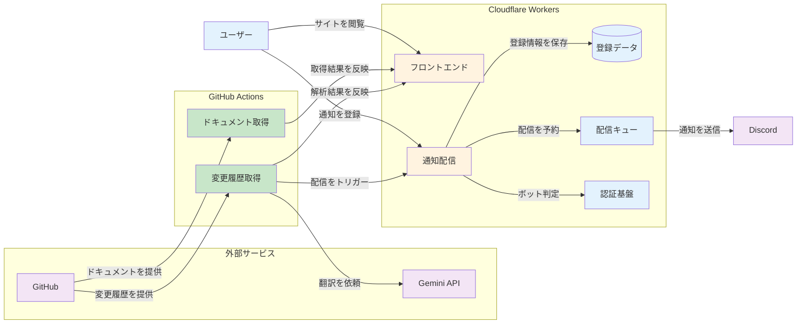

私は毎日のようにClaude Codeを使っています。使い倒しているからこそ、アップデートの内容は気になります。新機能が追加されれば取り入れたいですし、気になるバグ修正があれば「あの挙動、直ったのかな？」と確認したくなります。
ただ、Claude Codeの更新頻度はかなり高いです。2026年1月だけで23回のリリースがありました。そのたびに英語のCHANGELOG[^changelog]を開いて、項目を1つずつ読んで、「これは自分に関係あるかな？」と判断しなければなりません。いくら興味があるとはいえ、毎回やるのはしんどいです。

でも、CHANGELOGを全部追わなくても実務は回ります。大きな改修(たとえばスキルの導入など)があれば自分からキャッチアップしなくても自然と情報が入ってきますし、情報が出回った後に必要な部分だけ確認すれば十分です。わざわざ毎回CHANGELOGを確認するのは、割に合わないと思う人のほうが多いでしょう。私もそう思います。

1つだけ気になっていたことがありました。CHANGELOGの各項目に「それによって自分の作業がどう変わるのか？」が書かれていたら、追う価値があるかを一瞬で判断できます。

そんなサービスを探してみましたが、見当たりませんでした。
ということで作りました。

## Claude Code Changelog Viewer

サイトはこちらです。

https://claude-code-log.com/

GitHubリポジトリも公開しています。

https://github.com/Suntory-N-Water/claude-code-changelog-viewer

やっていることはシンプルで、Claude Codeの公式CHANGELOGを自動取得して、日本語に翻訳し、各変更の恩恵を解説するサイトです。
GitHub Actionsで毎時実行されるので、新しいバージョンがリリースされれば自動的に反映されます。私が手動で何かする必要はありません。

## 「変更前 / 変更後 / 恩恵」で伝える

CHANGELOGの項目は、「Added support for X」「Fixed Y when Z」のような1行の記述が並んでいるだけです。開発者向けの記録としては十分ですが、「それで自分の作業がどう変わるのか」がぱっと見ではわかりにくいと感じます。

そこで、このサイトでは各変更を「変更前はどうだったか」「変更後にどうなったか」「ユーザーにとっての恩恵は何か」の3点セットで表示するようにしました。

たとえば v2.1.41 の改修であった「**Added `claude auth login`, `claude auth status`, and `claude auth logout` CLI subcommands**」というCHANGELOGの項目を考えてみます。
これだけだと「認証関連のCLIコマンドが追加された」としかわかりません。
ですがこのように説明されれば、自分に関係あるかどうかがすぐにわかります。

- 変更前は認証状態の確認やログアウト操作を、明確なCLIサブコマンドを通じて直接実行する手段が限られていた。
- 変更後は `claude auth login/status/logout` コマンドにより、ターミナルから直接、現在の認証状況の確認やアカウントの切り替えが可能になった。
- これにより、複数の環境やアカウントを使い分ける際、現在のログイン状態をすばやく把握し、安全に認証管理を行えるようになった。

この推論にはGemini APIを使っています。CHANGELOGの各項目に対して、関連する公式ドキュメントの記述を検索して添えた上で、AIに「変更前/変更後/恩恵」を推論させるしくみです。
一部の改修では関連ドキュメントがない場合があります。AIのハルシネーションを抑えるためにも、そういった場合には推論は行わず、日本語訳だけを表示するようにしています。

## サイトの機能

### 機能エリア別の横断表示

Claude Codeの変更項目は、MCP、Hooks、IDE/VSCode、Skillsなど、さまざまな機能に関わっています。私自身、CHANGELOGを眺めていて「Skillsに関わる変更だけ見たい」と思うことがありました。バージョンごとにまとまっている形式だと、特定の機能がどう変わってきたかを追いにくいです。

各変更項目に機能エリアのタグを自動で付与し、機能単位でバージョンを横断して変更を一覧できるページを用意しました。

https://claude-code-log.com/features

タグ付けは正規表現によるルールベースの分類で行っています。たとえば `MCP` や `Model Context Protocol` を含む項目には「MCP」タグが付きます。現在はMCP、Hooks、IDE/VSCode、Skills、Memory、Permissionsなど11カテゴリに分類しています。
ただし、ルールベースだけでは誤分類が起きることがあるので、Gemini APIの推論時にタグの補正も一緒にやらせています。ルールベースで大まかに分類して、AIで微調整する二段構えです。

「MCP周りの変更だけ知りたい」「VSCode連携がどう進化しているか追いたい」という使い方ができます。

### Discord通知

サイトを毎回見に行くのも手間ですので、新しいバージョンがリリースされたらDiscordに通知を飛ばす機能も作りました。

https://claude-code-log.com/notify

登録はDiscordサーバの管理画面でWebhook URLを発行して、サイトの通知登録ページに貼り付けるだけです。bot対策としてCloudflare Turnstile[^turnstile]を入れているので、登録時にチェックが入ります。

通知の配信にはCloudflare Queues[^cloudflare-queues]を使っています。新バージョンが検出されると、GitHub Actionsから通知用のAPIにリクエストが飛び、キューに積まれます。キューの中身を1件ずつ取り出して、登録済みのWebhook URLに順番に通知を送るしくみです。Discord APIのレート制限を回避するために、送信ごとに1秒の間隔を入れています。

送信に3回連続で失敗したWebhookは自動的に無効化するようにしました。URLが無効になっていたり、サーバが削除されていたりする場合に、無駄なリクエストを送り続けないためです。

## 開発で工夫したこと

最初は、CHANGELOGの変更項目を1つずつGemini APIにリクエストしていました。でも、項目が多いと一瞬でリクエストが集中してしまいます。1回のリクエストですべての推論・翻訳・サマリーをまとめて処理する方式に変えました。

また、Gemini APIを選んだのは、無料枠の範囲内で翻訳・推論タスクに十分な出力品質が得られ、セットアップが楽だったからです。
ただ、無料枠にはレート制限があります。記事投稿時点(2026年2月)では、Gemini 3 Flashの無料枠は[1分あたり5リクエスト](https://ai.google.dev/gemini-api/docs/rate-limits)に制限されています。複数バージョンが同時に検出された場合や、リトライが発生した場合はすぐ上限に達してしまいます。

フォールバック[^fallback]先のモデルを複数用意しました。メインのモデルが429エラー(レート制限)を返したら次のモデルに切り替え、それもダメならさらに次へ、という構成です。

リクエスト間隔も調整しています。公式の上限ギリギリではなく、15秒(4 RPM[^rpm]相当)に設定して余裕を持たせています。

加えて、Geminiの思考トークン[^thinking-token](thinking)を無効化することで、トークン消費を抑えています。

無料で安定運用するには、APIをただたたくだけでは足りず、制限の中でやりくりするしくみが必要でした。

ソースコードはこちらです。

https://github.com/Suntory-N-Water/claude-code-changelog-viewer/blob/main/apps/changelog-fetcher/src/ai/gemini-client.ts

### ドキュメントの自動追跡

推論の品質を左右する重要なしくみがもう1つあります。このサイトでは、CHANGELOGの各項目に関連する公式ドキュメントを検索して、AIに渡すコンテキストとして使っています。この公式ドキュメントは、3時間ごとにGitHub Actionsで自動取得しています。

Claude Codeの公式サイトから[llms.txt](https://code.claude.com/docs/llms.txt)[^llms-txt]とドキュメントマップを取得し、両方をマージして重複を排除したうえで、48件のドキュメントをローカルに保存しています。サーバに負荷をかけないよう、5件ずつバッチで取得して500msの間隔を入れています。

ドキュメントを常に最新に保つことで、新機能が追加された直後でも関連する記述を見つけて推論に使えます。逆に、ドキュメントが古いままだと、新しいCHANGELOGの項目に対して「関連ドキュメントなし」と判定されて推論がスキップされてしまいます。自動追跡にはそういう意味があります。

## 完全無料で動かす

このサイトは運用コストがかかっていません。使っているサービスはすべて無料枠の範囲内です。

| サービス                                | 用途                                    | 無料枠                                                                                    |
| --------------------------------------- | --------------------------------------- | ----------------------------------------------------------------------------------------- |
| GitHub Actions                          | CHANGELOG取得、AI推論、ドキュメント取得 | パブリックリポジトリは無料                                                                |
| Cloudflare Workers[^cloudflare-workers] | Webサイトホスティング、通知API          | 1日10万リクエスト                                                                         |
| Cloudflare D1[^cloudflare-d1]           | Webhook URL管理                         | 5GBストレージ                                                                             |
| Cloudflare Queues[^cloudflare-queues]   | 通知配信キュー                          | 1日100万メッセージ                                                                        |
| Gemini API                              | 翻訳・推論                              | モデルにより[1分あたり5〜15リクエスト](https://ai.google.dev/gemini-api/docs/rate-limits) |

無料で安定運用するために一番効いているのは、冪等性[^idempotent]の設計です。CHANGELOGの各バージョンをSHA256[^sha256]でハッシュ化して前回の値と比較し、中身が変わっていなければ処理をスキップします。毎時実行していても、実際にGemini APIをたたくのは新バージョンが出たときだけです。2026年1月は23回のリリースがありましたが、それでも1日平均1回以下でした。ここが大事なところで、無駄なAPI呼び出しをゼロにできるかどうかが無料枠に収まるかを左右します。

GitHub Actionsも同様で、更新がなければ数十秒で早期終了するように設計しています。定期実行のほとんどは「更新なし→即終了」ですので、GitHub Actionsの実行時間が膨らむこともありません。

個人開発でランニングコストがかかると、モチベーションの維持が難しくなります。「無料で動き続ける」という制約を最初に置いたことで、冪等性やバッチ処理など設計上の工夫が生まれました。制約が設計をよくしてくれることもあります。

## システム構成

## 自動化のパイプライン

1. GitHub APIからCHANGELOG.mdを取得してバージョンごとに分割する
2. 各項目をパース[^parse]して、キーワードを抽出する
3. 抽出したキーワードでローカルに保存された公式ドキュメントを検索して、関連する記述をスニペット[^snippet]として取得する
4. 関連ドキュメント付きでGemini APIに投げて、日本語翻訳と「変更前/変更後/恩恵」を推論させる
5. 推論結果をAstroの `content/` 配下にシンボリックリンク[^symlink]として保存する
6. 処理終了後、自動で `git push` を行い、Astroの静的サイトとしてビルドして、Cloudflare Workers[^cloudflare-workers]にデプロイする

これがGitHub Actions[^github-actions]で毎時実行されます。新しいバージョンが検出されなければ何もしないので、無駄な実行コストは発生しません。
また、バージョンごとの内容をSHA256でハッシュ化して前回の値と比較し、本当に中身が変わった場合だけ再処理する冪等性[^idempotent]を担保しています。CHANGELOGは過去のバージョンの記述が後から修正されることもあるので、「新バージョンかどうか」だけでなく「内容が変わったかどうか」で判断する必要がありました。

プロジェクトはBunワークスペースによるモノレポ[^monorepo]構成で、フロントエンド(Astro)・CHANGELOG解析・ドキュメント追跡、通知更新の4アプリケーションに分かれています。
GitHubリポジトリも公開しているので、詳しい実装はそちらをご覧ください！

## まとめ

- Claude Codeは更新頻度が高く、英語のCHANGELOGを毎回追うのは現実的ではない
- 「変更前/変更後/恩恵」の3点セットで各変更が自分に関係あるかをすばやく判断できるようにした
- 機能エリア別の横断表示やDiscord通知で、関心のある情報だけを効率よくキャッチアップできる
- GitHub Actions + Cloudflare + Gemini APIの無料枠だけで運用しており、冪等性設計で無駄なAPI呼び出しをゼロにしている
- 毎時実行の自動化パイプラインにより、運用の手間はほぼかからない

## 参考

https://github.com/anthropics/claude-code

[^changelog]: ソフトウェアの変更履歴をまとめたファイル。バージョンごとに追加機能・修正内容などが記録されている。
[^parse]: テキストデータを解析して、プログラムが扱いやすい構造に変換すること。ここではCHANGELOGの文章を項目ごとに分解する処理を指す。
[^snippet]: テキストやコードの短い抜粋のこと。ここでは公式ドキュメントから関連する部分だけを抜き出したものを指す。
[^cloudflare-workers]: Cloudflareが提供するサーバレス実行環境。Webサイトを世界中のエッジサーバから高速に配信できる。
[^github-actions]: GitHubが提供するCI/CD自動化サービス。cronスケジュールで定期実行も可能。
[^idempotent]: 同じ操作を何度実行しても結果が変わらない性質のこと。ここでは、同じバージョンのCHANGELOGを何度処理しても同じ出力が得られることを指す。
[^turnstile]: Cloudflareが提供するbot対策サービス。従来のCAPTCHAとは異なり、多くの場合ユーザーに操作を求めずにbotかどうかを判定する。
[^cloudflare-queues]: Cloudflareが提供するメッセージキューサービス。非同期でメッセージを処理でき、Workers上で動作する。
[^cloudflare-d1]: CloudflareのサーバレスSQLiteデータベース。Workers上から直接アクセスでき、無料枠で利用できる。
[^fallback]: 主要な手段が失敗したときに切り替える代替手段のこと。ここではメインのAIモデルが使えないとき、別のモデルに自動で切り替えることを指す。
[^rpm]: Requests Per Minute(1分あたりのリクエスト数)の略。APIの利用量制限の単位としてよく使われる。
[^thinking-token]: AIが回答を生成する前に内部で推論する過程で消費されるトークン。無効化すると推論過程を省略し、トークン消費量を削減できる。
[^llms-txt]: Webサイトの内容をLLM(大規模言語モデル)が効率的に読み取れるように、ページ一覧や要約をまとめたテキストファイル。
[^sha256]: データを固定長の文字列(ハッシュ値)に変換するアルゴリズムの1つ。同じデータからは必ず同じ値が生成されるため、データの変更検知に使われる。
[^symlink]: 別の場所にあるファイルへの参照(ショートカットのようなもの)。実体を複製せずに、複数の場所から同じファイルを参照できる。
[^monorepo]: 複数のアプリケーションやライブラリを1つのリポジトリで管理する手法。コードの共有や一括管理がしやすくなる。
