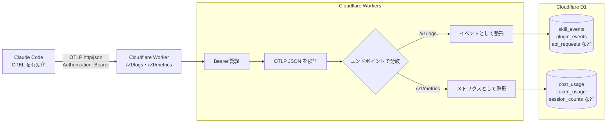

AI コーディングアシスタントの利用が広がり、Claude Code のように Skill や Plugin でカスタマイズできる環境が整ってきました。カスタマイズの幅が広がる一方、「自分で設定したものが実際に機能しているか」は確認しにくくなっています。

Claude Code を使う時間が増えると、どの機能をどれくらい使っているのかを見たくなります。特に Skills や Plugins は、追加した瞬間は便利そうに見えますが、実際にどの場面で使われているのかは見えづらいです。

自分で明示的に「この Skill を使って」と指示している場合は、使っている感覚があります。Claude Code は、ユーザーが明示的に指示しなくても、文脈から必要だと判断して Skill を起動することがあります。私はこの「意識しなくても動いているか」を見たいと思いました。

そこで今回は、自分の Claude Code 環境を棚卸しするために、Claude Code の [OpenTelemetry](https://code.claude.com/docs/en/monitoring-usage) 出力を Cloudflare Worker で受け取り、[Cloudflare D1](https://developers.cloudflare.com/d1/) に保存して可視化できるようにしました。

## なぜ利用状況を見たいのか

見たいのは、Claude Code をどのように使っているかです。

Skill の利用状況は、その一部です。たとえば Git のコミットメッセージをある程度そろえたいとき、「この形式で書いてください」と毎回指示するより Skill に寄せた方が楽です。Claude Code が必要なタイミングで自動的に Skill を使ってくれれば、私の入力も短くなります。

気になるのは、自分が明示的に呼び出した回数ではありません。Claude Code が文脈から判断して、どれくらい自律的に起動しているかです。

「便利なはず」と思って作った Skill でも、description が弱いと、必要な場面でも Claude Code がその Skill を見つけられないかもしれません。明示的に呼び出さなくても自然に使われているなら、その Skill はかなり良い状態だと思います。

利用状況が見えると、次の一手を考えやすくなります。説明文を直すのか、依頼のしかたを変えるのか、そもそもその作業を Skill にするべきではなかったのか。Skill だけでなく、Plugin、API リクエスト、トークン使用量、セッション数も同じです。まずは数字で見られる状態にしたいです。

## 今回やること

今回は Cloudflare Worker に OTLP の `/v1/logs` と `/v1/metrics` を用意し、Claude Code から送られてくるログとメトリクスを D1 に保存します。

Claude Code は、[OpenTelemetry の logs/events と metrics をエクスポートできます](https://code.claude.com/docs/en/monitoring-usage)。公式ドキュメントを見ると、Skill の起動を表す `claude_code.skill_activated` だけでなく、Plugin の読み込み、API リクエスト、コスト、トークン使用量、セッション数なども出力できます。

今回作った Worker では、ログ系のイベントを `/v1/logs` で受け取り、メトリクス系のデータを `/v1/metrics` で受け取ります。保存先は D1 です。

Cloudflare Worker がリクエストを受け取り、必要な値を取り出して D1 に入れておけば、SQL で雑に集計できます。

## 全体構成



Claude Code から OTLP の JSON を送信し、Cloudflare Worker がリクエストを受け取ります。`/v1/logs` ではイベントを処理し、`/v1/metrics` ではメトリクスを処理します。

Cloudflare Workers の[対応プロトコル](https://developers.cloudflare.com/workers/reference/protocols/)を見ると、基本は HTTP / HTTPS の `fetch()` ハンドラでリクエストを受ける形です。そのため、OTLP は `grpc` ではなく `http/json` を使いました。

OTLP の JSON は入れ子構造になっているため、Worker 側で必要な値を取り出して D1 に保存します。公式の JSON サンプルとしては [opentelemetry-proto の logs.json](https://github.com/open-telemetry/opentelemetry-proto/blob/main/examples/logs.json) がありますが、この記事では実装側の処理に話を絞ります。

## Claude Code から OTEL を送る設定

Claude Code 側では、`~/.claude/settings.json` に `env` を設定します。私の用途では、以下のような設定にしました。

```json
{
  "env": {
    "CLAUDE_CODE_ENABLE_TELEMETRY": "1",
    "OTEL_LOG_TOOL_DETAILS": "1",
    "OTEL_LOGS_EXPORTER": "otlp",
    "OTEL_METRICS_EXPORTER": "otlp",
    "OTEL_METRICS_INCLUDE_VERSION": "true",
    "OTEL_EXPORTER_OTLP_PROTOCOL": "http/json",
    "OTEL_EXPORTER_OTLP_ENDPOINT": "https://cc-monitor-worker.<account>.workers.dev",
    "OTEL_EXPORTER_OTLP_HEADERS": "Authorization=Bearer <登録したトークン>"
  }
}
```

`CLAUDE_CODE_ENABLE_TELEMETRY=1` は必須です。`OTEL_LOGS_EXPORTER=otlp` を指定するとイベントが送信され、`OTEL_METRICS_EXPORTER=otlp` を指定するとメトリクスも送信されます。

今回重要なのは `OTEL_LOG_TOOL_DETAILS=1` です。これがないと、ユーザー定義 Skill やサードパーティ由来の Skill 名が `custom_skill` のように匿名化される場合があります。自分の Skill の棚卸しをしたいので、ここは有効にしました。

`OTEL_LOG_USER_PROMPTS` や `OTEL_LOG_TOOL_CONTENT` は有効にしていません。今回は利用状況を見たいだけで、プロンプト本文やツールの入出力まで保存したいわけではないからです。

## D1 に保存するデータ

詳しい実装は [Suntory-N-Water/cc-monitor-worker](https://github.com/Suntory-N-Water/cc-monitor-worker) にありますので、興味ある人は見てみてください！Cloudflare Workers のデプロイ先を変更するだけで動作するしくみにはなっています。

最初は Skill の起動ログだけを考えていましたが、Claude Code の利用状況を見るなら、コストやトークン使用量も同じ場所に保存した方が見やすいです。現在は、以下のようなテーブルに分けています。

| テーブル | 保存するもの |
|---|---|
| `skill_events` | Skill の起動ログ |
| `plugin_events` | Plugin のロード・インストール履歴 |
| `api_requests` | API リクエストのモデル、コスト、トークン数 |
| `tool_results` | ツール実行結果 |
| `hook_executions` | Hook の実行結果 |
| `cost_usage` | コスト使用量 |
| `token_usage` | トークン使用量 |
| `session_counts` | セッション数 |
| `active_time` | アクティブ時間 |

普段見たいのは Skill 名、起動方法、Plugin 名、コスト、トークン使用量あたりです。プロンプト本文やツールの出力内容は見たい対象ではないので、Claude Code 側の設定でも送らないようにしています。

## Worker がリクエストを受け取って D1 に入れる

Worker 側は Hono で実装しています。全文は載せませんが、実際のフローはこのような感じです。

1. `/v1/*` のリクエストで `Authorization` ヘッダを確認する
2. `/v1/logs` と `/v1/metrics` にルーティングする
3. OTLP の JSON ペイロードを検証する
4. `/v1/logs` では `skill_activated`、`plugin_loaded`、`api_request` などのイベントごとにレコードを作成
5. `/v1/metrics` では `claude_code.cost.usage`、`claude_code.token.usage`、`claude_code.session.count` などのメトリクスごとにレコードを作成
6. D1 に保存する
7. Claude Code には `{ partialSuccess: {} }` を返す

Cloudflare Worker で受け取る場合は、OTLP の JSON を自分でたどって、必要な属性を取り出して、D1 のテーブルに入れる必要があります。ここは BigQuery や専用の OTEL バックエンドに送る場合とは異なります。

今回の目的は、きれいなトレース基盤を作ることではありません。Claude Code の利用状況をあとから見られるようにすることです。Worker 側も、まずはログとメトリクスの受信、検証、保存に絞りました。

## 実際に D1 を見てみる

まずは Skill ごとの起動回数を見ました。

```sql
SELECT
  skill_name,
  COUNT(*) AS cnt
FROM skill_events
GROUP BY skill_name
ORDER BY cnt DESC;
```

結果は以下のようになりました。

| Skill | 回数 |
|---|---:|
| **general-dev-skills:managing-Git-GitHub-workflow** | **9** |
| wrangler | 8 |
| general-dev-skills:actions-check | 5 |
| notebooklm | 3 |
| agent-browser | 2 |
| adr-creator | 1 |
| fewer-permission-prompts | 1 |
| hono | 1 |
| init | 1 |
| managing-Git-GitHub-workflow | 1 |
| mermaid-diagrams | 1 |
| playwright-best-practices | 1 |
| simplify | 1 |
| skill-creator | 1 |

一番多かったのは GitHub 関連の Skill でした。コミットや GitHub Actions の確認は日常的に発生するので、ここが多いのは自然です。利用頻度の高い作業ほど Skill と相性がよく、数字にもそのまま出ているように見えます。

`playwright-best-practices` のような Skill は 1 回だけでした。これは使われていないというより、用途が限定的な Skill だと考えています。Playwright の実装やレビューをしているときに起動すればよいので、GitHub 関連の Skill と同じ回数になる必要はありません。

この結果だけでも、Skill の評価は単純な回数だけでは決められないことが分かります。毎日のように使う Skill もあれば、特定の作業でだけ使えれば十分な Skill もあります。

回数が見えると棚卸しはしやすくなります。よく使われる Skill はそのまま育てればよいですし、用途が限定的な Skill は「必要な場面で本当に起動しているか」を別の観点で見ればよいです。

## やってみて

まだログを取り始めた段階ですので、「なんとなく使っている気がする」で放置せず、数字で見直す土台は作れたと思います。

[社員に何もさせずにClaude Code利用ログを集める ── 数百名規模のOpenTelemetry収集基盤の構築](https://techblog.zozo.com/entry/claudecode-otel)では、数百名規模の Claude Code 利用ログを Google Cloud と BigQuery で扱っています。組織で本格的に使うなら、既存の分析基盤に乗せる方がよいと思います。今回はそこまで大きな話ではなく、個人でまず試すために Cloudflare Worker と D1 を使いました。

もう少しデータがたまったら、Skill の description を直した前後で自動起動が増えるのか、Plugin ごとのコストやトークン使用量に偏りがあるのかも見てみたいです。

## まとめ


- `CLAUDE_CODE_ENABLE_TELEMETRY=1` と各エクスポーター設定を `settings.json` に追加するだけで利用状況の送信をできる
- Cloudflare Worker で OTLP http/json のリクエストを受け取り、D1 に保存するとあとから SQL で集計できる
- Skill の起動回数は見えるが、評価は単純な回数だけでは決められない。毎日使う Skill と特定の作業でだけ使う Skill とでは期待値が違う
- `OTEL_LOG_TOOL_DETAILS=1` がないと Skill 名が匿名化されてしまうため、詳細な利用状況を見たい場合は有効にする

## 参考

https://code.claude.com/docs/en/monitoring-usage

https://code.claude.com/docs/en/env-vars

https://developers.cloudflare.com/workers/reference/protocols/

https://developers.cloudflare.com/d1/

https://github.com/Suntory-N-Water/cc-monitor-worker

https://techblog.zozo.com/entry/claudecode-otel
