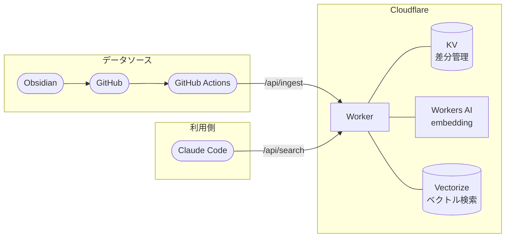

あいまいな記憶を手がかりに過去のメモを引き出したいとき、キーワード検索では対応できないことがあります。たとえば、旅行の候補をどこかにメモしていた記憶はあるのに、具体的な地名が思い出せないとき、「旅行」でメモを検索しても旅行という単語が入っているメモしか出てきません。「滋賀も行ってみたい」とメモした記録は、旅行フォルダにも旅行タグにも入っていないので、検索には引っかかりません。

こういうキーワード検索の限界を解消するために、Obsidian のメモを [Cloudflare Vectorize](https://developers.cloudflare.com/vectorize/) でベクトル化し、Claude Code から API 経由で意味検索できるしくみを作りました。この記事では、作った動機・全体構成・実際の検索の様子を紹介します。

## 週次振り返りを2年続けて気付いたこと

定期的にメモを振り返ればよい、と思って試みたこともあります。

スプレッドシートと Notion を使って、その週の出来事や学びを毎週末に記録する習慣を 2 年ほど続けました。最初のうちは機能していました。1週間を整理して次の週に向ける、というリズムが作れていた気がします。でも半年、1年と経つうちに、振り返りの目的が少しずつズレていきました。

週末になると「今週の振り返りをやらないと」と思うようになりました。Notion のテンプレートを開いて、決まった項目を埋めて、保存して完了です。振り返りを「している」のではなく、「こなしている」という感覚に変わっていきました。

ある週末、振り返りをやめることにしました。

しばらく経ってから気付いたのは、問題が「振り返りをしていたこと」ではなく、「振り返りをするために記録していたこと」だったということです。いつの間にか、記録することが目的になっていました。振り返りは手段のはずなのに、週次の記録という形式を維持することが目的に変わっていたのだと思います。

## 「気になったとき」だけ使えるしくみへ

もともと私は、思いつきや突拍子もないことにワクワクを見出してしまう性格です。固まったフォーマットで記録を続けることがどうしても続かないと分かった以上、振り返りのやり方を変える必要がありました。

行き着いたのが「振り返りのタイミングを決めない」という設計です。旅行先を考えていて過去のメモが気になったとき、技術調査をしていて以前似たことを調べた気がするとき、そういう「気になった瞬間」に検索するようにしています。

## 全体像

私は普段から Obsidian を使って日々の記録や気になったことをまとめています。Markdown ファイルで管理できるので、GitHub との連携が簡単です。



Obsidian でメモを書き、GitHub に同期し、定期的に GitHub Actions が Worker の `/api/ingest` をたたいてベクトル化・保存する流れです。Claude Code は `/api/search` を通じて検索します。

日々のメモは 2 つの経路で Obsidian に入ってきます。1つは [Thino](https://github.com/Quorafind/Obsidian-Thino) というプラグインで、Twitter のような投稿形式でその場に思いついたことを書けます。もう1つは LINE からの同期で、外出中に思いついたことを LINE で自分宛てに送ると、自動で Obsidian に記録されます。

これらのメモは毎日デイリーレポートとしてまとめられます。Thino のメモや LINE のメモに加えて、ネットで気になった記事を Obsidian に保存した際の見出しも集約されます。この設計では、「5月10日には DevOps 関連の記事を読んでいた」という当時の関心領域を後から確認できます。このデイリーレポートを単位として Vectorize にベクトル化して保存しています。メモ単体だと当日の文脈が欠落するので、デイリーレポートにまとめることで「その日に何に興味を持っていたか」という周辺情報も一緒にベクトル化できます。

## Claude Code から検索する

検索は Claude Code のターミナルから curl で呼び出しています。「旅行でどこか候補を考えてたっけ」というクエリを投げると、こういう形で API をたたきます。

```bash
jq -cn --arg q "旅行でどこか候補を考えてたっけ" '{"query": $q, "topK": 10}' \
  | curl -s -X POST \
      -H "Content-Type: application/json" \
      -H "X-API-Key: $API_KEY" \
      --data @- \
      "https://<your-worker>.workers.dev/api/search"
```

レスポンスはデイリーレポートの生データです。

```json
{
  "results": [
    {
      "score": 0.5912,
      "content": "デイリーレポート - 2026-04-24 / メモ / 2026-04-24 のメモ\n- 19:31:13 京都の話 ...",
      "date": "2026-04-24",
      "source": "DailyReports",
      "path": "DailyReports/2026-04/2026-04-24_daily_report.md",
      "github_url": "https://github.com/<your-org>/<your-repo>/blob/main/DailyReports/2026-04/2026-04-24_daily_report.md"
    },
    {
      "score": 0.5736,
      "content": "デイリーレポート - 2025-11-12 / Zettelkasten / FleetingNote / 滋賀旅行を計画しているぞ！",
      "date": "2025-11-12",
      "source": "DailyReports",
      "path": "DailyReports/2025-11/2025-11-12_daily_report.md",
      "github_url": "https://github.com/<your-org>/<your-repo>/blob/main/DailyReports/2025-11/2025-11-12_daily_report.md"
    }
  ]
}
```

Worker は検索結果を返すだけで、「この中でどれが良さそうか」という解釈は Claude Code に任せています。事実の取得と解釈を分離することで、Worker 側の実装がシンプルになります。

## やってみて

実際に使ってみると、モヤモヤが発見に変わる体験があります。たとえば、次の旅行先を考えていて、過去の自分はどこか候補を考えていたかなと思って検索すると、「村上(新潟県)」や「滋賀」という候補が出てきます。「旅行」という単語で検索しても出てこなかった記録が、意味の近さで引っかかってきます。週次振り返りをしていたときには、こういう体験はありませんでした。

「なんかあったよな」というぼんやりした感覚を手がかりに、過去のメモを引き出せます。そのたびにモヤモヤが消えてすっきりするから、このしくみを使い続けています。

## まとめ

- キーワード検索は思い出せている言葉しか検索できない。あいまいな記憶を手がかりに過去を引き出すには、意味ベースの検索が向いている
- スケジュールに縛られた週次振り返りは続かなかった。「気になったとき」だけ使えるしくみの方が自分には合っていた
- Obsidian + GitHub + Cloudflare Workers + Vectorize の組み合わせで、個人規模のセマンティック検索[^semantic-search] 基盤を実質コストゼロで作れる
- ベクトル化の単位はデイリーレポートにすることで、個別のメモだけでは伝わらない「当日の関心文脈」も一緒に保存できる
- Worker は生データを返すだけにして、解釈は Claude Code に委ねる設計にしておくと、実装がシンプルになる

## おまけ: KV による差分管理

毎回全件をリクエストすると、Vectorize への書き込みと embedding 生成のリクエスト数が無駄に増えます。[Cloudflare KV](https://developers.cloudflare.com/kv/) を使ってファイルの変更有無を記録しておき、前回以降に変更されたファイルだけを処理するようにしています。

## 参考

https://developers.cloudflare.com/vectorize/

https://developers.cloudflare.com/workers/

https://developers.cloudflare.com/workers-ai/

https://developers.cloudflare.com/kv/

https://obsidian.md/

https://github.com/Quorafind/Obsidian-Thino

[^semantic-search]: キーワードの完全一致ではなく、文章の意味や文脈の近さで検索するしくみ。「旅行」という単語が含まれていなくても、旅行に関連する文脈のメモを引き出せる。
