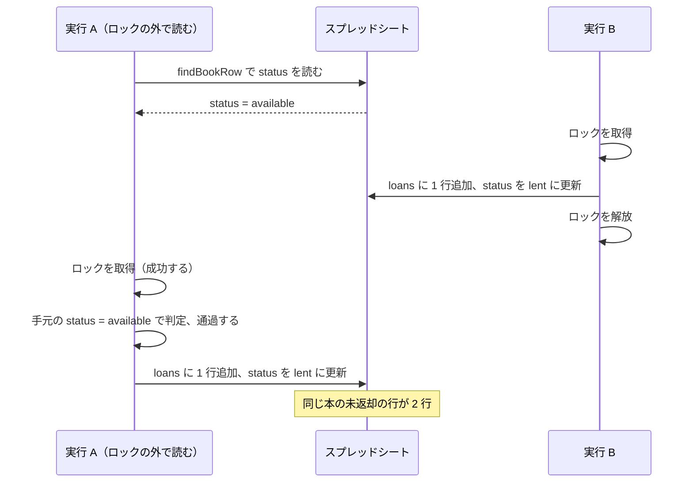

社内に置いてある本は、誰が借りていったのか分からなくなることがありました。貸し借りを記録して一覧できる仕組みが欲しくなり、Google Apps Script とスプレッドシートでウェブアプリを作りました。

データの置き場所はスプレッドシートにしましたが、利用者には直接見せたくありません。閲覧できると誰が何を借りているかが全部見えます。編集できると貸出の記録を書き換えられます。そこでスプレッドシートは私だけが開ける状態にして、利用者ができる操作はウェブアプリの画面だけに限りました。

1 冊の本を同時に 2 人が借りられては困るので、排他制御が必要になります。GAS でこれを行う仕組みは `LockService` で、貸出の処理をロックの取得と解放で囲めば済むと考えていました。

ところが、ロックを取得していても同じ本の貸出が 2 回実行される書き方があります。`LockService` が同時に実行させないのは同じコードの範囲であって、スプレッドシートの行ではないためです。判定に使う値をロックの外で読むと、その値はロックを取得する前に他の実行から書き換えられている可能性があります。

この記事に書くのは、その 2 回の貸出を実際に発生させて確かめた結果と、判定に使う値を読む位置の決め方です。

> [!NOTE]
> Apps Script の V8 ランタイムでウェブアプリを作り、スプレッドシートを保存先にしている場合を対象にしています。情報は 2026 年 9 月 10 日時点のものです。

## 書籍貸出アプリとスプレッドシートの構造

排他制御を確かめるために作った書籍貸出アプリの画面は、3 つの部分でできています。自分が借りている本の一覧、蔵書の一覧と絞り込み、管理者だけに表示される登録フォームです。データの保存先はスプレッドシート 1 つで、`books` / `loans` / `config` の 3 シートに分けました。

<!-- TODO(media): スクリーンショットを入れる。/exec を開いた直後のウェブアプリ全体を写す。読者が確認するのは、蔵書の表に「在架」と「貸出中」が並び、管理者のアカウントでは登録フォームが表示されること。代替テキスト: 書籍貸出アプリの画面。自分が借りている本、蔵書の一覧、蔵書の登録フォームが縦に並んでいる -->

このスクリプトは、どのスプレッドシートにも紐づいていません。GAS のスクリプトには、スプレッドシートやドキュメントに紐づけて作る形（コンテナバインド）と、単独で作る形（スタンドアロン）の 2 つがあります。ウェブアプリとして公開するので、後者にしました。

紐づいていないので、読み書きする対象のスプレッドシートは ID を指定して開きます。その ID の置き場所はスクリプトプロパティにしました。最初は `config` シートに書こうとしましたが、`config` シートを読むにはスプレッドシートを開く必要があり、開くには ID が必要です。同じシートの中に置くと、ID を得るために ID が必要になります。

```ts src/sheet.ts
export const SPREADSHEET_ID_PROPERTY = 'SPREADSHEET_ID';

let cachedSpreadsheet: GoogleAppsScript.Spreadsheet.Spreadsheet | undefined;

export function openSpreadsheet(): GoogleAppsScript.Spreadsheet.Spreadsheet {
  if (cachedSpreadsheet) {
    return cachedSpreadsheet;
  }
  const id = PropertiesService.getScriptProperties().getProperty(
    SPREADSHEET_ID_PROPERTY,
  );
  if (!id) {
    throw new Error(
      `スクリプトプロパティ ${SPREADSHEET_ID_PROPERTY} が設定されていません`,
    );
  }
  cachedSpreadsheet = SpreadsheetApp.openById(id);
  return cachedSpreadsheet;
}
```

ID を指定して開くには、`appsscript.json` の `oauthScopes` に権限を書いておく必要があります。スプレッドシート向けの権限は 2 つです。開いているスプレッドシート 1 つだけを許可する `https://www.googleapis.com/auth/spreadsheets.currentonly` と、利用者のスプレッドシート全体を許可する `https://www.googleapis.com/auth/spreadsheets` です。単独で作ったスクリプトには「開いているスプレッドシート」が存在しないため、後者を指定して `openById()` が成功することを確かめました。`currentonly` に変えたときにどうなるかは確かめていません。

## LockService が同時に実行させない範囲

貸出の処理では、スプレッドシートへの書き込みが 2 か所あります。1 つは `loans` への 1 行の追加、もう 1 つは `books` の該当行の `status` を `lent` にする更新です。この 2 つの間に別の実行が同じ処理を始めると、1 冊の本に貸出の記録が 2 行できます。

単独で作ったスクリプトなので、使えるのはスクリプトロックです。[リファレンス](https://developers.google.com/apps-script/reference/lock/lock-service)には、`getDocumentLock()` が `null` を返す条件として `if called from a standalone script or webapp` と書かれています。

`getScriptLock()` の説明は次の一文です。ここに、このロックが何を単位にしているのかが書かれています。

> prevents any user from concurrently running a section of code

同時に実行させない対象は `a section of code` です。利用者が誰であっても、この範囲を同時に走らせるのは 1 つの実行だけになります。行やセルではなく、コードの範囲が単位です。

ロックの取得と解放は関数にまとめました。

```ts src/lending.ts
const LOCK_TIMEOUT_MS = 10_000;

/** ロックの中でしか呼ばない。ロック取得前に読んだ status は他の実行に書き換えられている可能性がある */
function withScriptLock<T>(action: () => T): T {
  const lock = LockService.getScriptLock();
  if (!lock.tryLock(LOCK_TIMEOUT_MS)) {
    throw new Error('混み合っています。しばらくしてからもう一度お試しください');
  }
  try {
    return action();
  } finally {
    lock.releaseLock();
  }
}
```

2 つの実行が同時に入らないのは `action` の中だけです。`action` に渡す前に読んだ値は、この範囲の外で読んだ値なので、`action` の中で使っても他の実行から保護されていません。

## 状態を読む位置をロックの外へ出す

貸出の処理を 2 つに分けました。`commitLoan` が判定と書き込みを行い、`lendBook` がロックの取得と `commitLoan` の呼び出しを行います。

```ts src/lending.ts
function commitLoan(
  target: { rowNumber: number; book: Book },
  email: string,
): Loan {
  const { rowNumber, book } = target;
  if (book.status === 'retired') {
    throw new Error('この本は除籍されています');
  }
  if (book.status === 'lent') {
    throw new Error('この本はすでに貸出中です');
  }
  // ...（貸出上限の判定、loans への追加、books.status の更新は省略）
  getSheet(SHEET.books).getRange(rowNumber, BOOKS_COL.status).setValue('lent');
  SpreadsheetApp.flush();
  return loan;
}

export function lendBook(bookId: string): Loan {
  const email = requireActiveUserEmail();
  return withScriptLock(() => commitLoan(findBookRow(bookId), email));
}
```

見るのは `findBookRow` の位置です。`lendBook` では、この呼び出しがコールバックの中にあります。行番号と `status` の取得元は、ロックを取得した後の 1 回の `getValues()` です。

この形なら 2 回目は拒否されます。在架の本を 1 冊選び、`lendBook` を続けて 2 回呼ぶ `probeDoubleLend` を書いて、エディタから実行しました。

```
22:37:50 情報 対象: プラチナデータ (c1a6b626-48e9-420b-9bca-d288c8240436)
22:37:50 情報 1 回目: 成功 loanId=5f8e0eba-4e5f-41cd-88a0-0dccfcb83ef0
22:37:50 情報 2 回目: 失敗 この本はすでに貸出中です
```

`loans` に増えた未返却の行は 1 行で、`books.status` は `lent` になりました。2 回目が拒否された理由は、`findBookRow` が読み直した `status` が `lent` だったためです。

次に、読む位置だけをロックの外へ出した場合を確かめました。`lendBook` との違いが `findBookRow` の位置だけになる関数を用意しています。

```ts src/lending.ts
export function lendBookReadingOutsideLock(
  bookId: string,
  beforeLock: () => void,
): Loan {
  const email = requireActiveUserEmail();
  const target = findBookRow(bookId);
  beforeLock();
  return withScriptLock(() => commitLoan(target, email));
}
```

この形で貸出が 2 回実行されるのは、状態を読んでからロックを取得するまでの間に、別の実行が同じ本の貸出を終えたときだけです。



実行 A がロックを取得できたのは、実行 B がすでに解放しているからです。ロックは正しく働いています。それでも判定を通ったのは、判定に使う `status` が図の 2 行目で読んだ `available` のままだからです。

この順序をブラウザの操作で作ることはできません。そこで `beforeLock` に `lendBook` を渡し、1 回の実行の中で順序を固定しました。

```ts src/probe.ts
lendBookReadingOutsideLock(target.bookId, () => {
  const interrupting = lendBook(target.bookId);
  results.push(`割り込んだ貸出: 成功 loanId=${interrupting.loanId}`);
});
```

```
20:40:38 情報 対象: プラチナデータ (c1a6b626-48e9-420b-9bca-d288c8240436)
20:40:38 情報 割り込んだ貸出: 成功 loanId=f7112ddc-57d8-46b3-a6c6-9a94f5ba2437
20:40:38 情報 ロックの外で読んだ値による貸出: 成功 loanId=cc8e5531-a35c-4ea1-ace7-63a43a579aa7
20:40:38 情報 c1a6b626-48e9-420b-9bca-d288c8240436 の未返却の行: 2 行
```

2 件目の書き込みは `withScriptLock` の中で実行されています。ロックの取得も成功しています。それでも 1 冊の本に未返却の貸出が 2 行できました。

確かめるのに使ったのは、clasp 3.4.1、Apps Script の V8 ランタイム、rollup 4.63.1 です。

<!-- TODO(link): clasp 3.x + rollup の記事を公開したら、この位置に /blog/clasp3-rollup-typescript-gas-deploy へのリンクを入れる -->


## 変更が確定する位置

読む位置と同じ話が、書いた後にもあります。`commitLoan` は `setValue` の直後に `SpreadsheetApp.flush()` を呼ぶ形にしました。

[リファレンス](https://developers.google.com/apps-script/reference/spreadsheet/spreadsheet-app#flush)の `flush()` の説明は `Applies all pending Spreadsheet changes` で、同じページのサンプルには次のコメントが付いています。

> the updates may be applied live or may all be applied at once when the script completes

変更がスクリプトの終了時にまとめて適用される場合、確定するのはロックを解放した後です。次にロックを取得した実行は、確定前の値を読むことになります。ロックの外で読むと古い値が入り、ロックの外で確定すると古い値が残ります。どちらも、ロックの範囲がデータを扱う範囲より狭いことが原因です。

`flush()` を外した状態は確かめていないため、この呼び出しはリファレンスの記述に沿って入れたものです。

## 2 つの実行を同時に始める手段

ブラウザのクリックでは、2 つの実行を同じ瞬間に始められません。そこで、スクリプトロックを 20 秒保持するだけの関数を用意しました。

```ts src/probe.ts
const LOCK_HOLD_MS = 20_000;

export function holdScriptLock(): string {
  const lock = LockService.getScriptLock();
  if (!lock.tryLock(1_000)) {
    throw new Error('ロックを取得できませんでした');
  }
  const startedAt = new Date().toISOString();
  try {
    Utilities.sleep(LOCK_HOLD_MS);
  } finally {
    lock.releaseLock();
  }
  const message = `${startedAt} から ${LOCK_HOLD_MS} ミリ秒ロックを保持しました`;
  console.log(message);
  return message;
}
```

これをエディタから実行し、保持している間にウェブアプリで「借りる」を押します。ボタンは 10 秒ほど「通信中です」の表示のまま待たされた後、次のメッセージで失敗しました。

```
Error: 混み合っています。しばらくしてからもう一度お試しください
```

`LockService.getScriptLock()` は実行をまたいで共有されます。エディタからの実行がロックを保持している間、ウェブアプリからの実行は同じロックの解放を待ちました。`tryLock(10_000)` は 10 秒待っても取得できず、`withScriptLock` で例外が発生しています。蔵書の状態は「在架」のまま、「自分が借りている本」も空でした。`appendRow` と `setValue` はどちらもロックの中にしかないため、書き込みは 1 回も実行されていません。

サーバ側のエラーメッセージは「混み合っています。しばらくしてからもう一度お試しください」だけで、`Error: ` は含めていません。この前置きが表示されるのは、`google.script.run` の `withFailureHandler` に渡るオブジェクトの `message` に、サーバの例外の文字列表現がそのまま入るためです。利用者に見せる文字列としては不要なので、クライアント側で取り除きました。

```js src/index.html
google.script.run
  .withSuccessHandler(resolve)
  .withFailureHandler((error) =>
    reject(new Error(error.message.replace(/^Error:\s*/, ''))),
  )
  [name](...args);
```

この修正を入れた後、同じ手順でもう一度「借りる」を押しました。

<!-- TODO(media): スクリーンショットを入れる。前置きを取り除いた版で、holdScriptLock の実行中に「借りる」を押した直後のウェブアプリを写す。読者が確認するのは、赤字のエラーメッセージに `Error: ` が付いていないことと、蔵書の状態が「在架」のままであること。代替テキスト: 画面上部に「混み合っています。しばらくしてからもう一度お試しください」と赤字で表示され、蔵書の表の状態欄は「在架」のままになっている -->

エラーメッセージから `Error: ` が消え、蔵書の状態は「在架」のままです。

ここまでの 3 つの試し方は、どれも 2 つの実行を同じ瞬間に始めたものではありません。`probeDoubleLend` は 1 回の実行の中で `lendBook` を 2 回呼んだもの、`probeStaleRead` は `beforeLock` で順序を固定したもの、`holdScriptLock` は先にロックを取得しておいて待たせたものです。同じ瞬間に 2 つの実行を始める手段は、この環境では用意できませんでした。

貸出が 2 回実行されるのは、2 つの実行の順序が図の形になったときだけです。ブラウザで 2 つのタブを同時に押しても、状態を読んでからロックを取得するまでの間に別の実行が貸出を終える順序になるとは限りません。この不具合は狙って再現できないので、動作確認で見つかることを前提にはできません。判定に使う値を読む位置は、試験ではなくコードの構造で固定します。

## まとめ

- `LockService.getScriptLock()` が同時に実行させないのは、同じコードの範囲である。スプレッドシートの行ではない。リファレンスの説明は `prevents any user from concurrently running a section of code`
- ロックの外で読んだ `status` をロックの中で判定に使うと、同じ本の貸出が 2 回実行される。判定に使う値は、ロックを取得した後に読み直す
- シートの変更はスクリプトの終了時にまとめて適用される場合があると、`SpreadsheetApp.flush()` のリファレンスに書かれている。ロックを解放する前に確定させるため、更新の直後に `flush()` を呼ぶ
- スクリプトロックは実行をまたいで共有される。待機時間を超えた側は例外になり、書き込みを実行しない
- 貸出が 2 回実行される順序は、エディタからの実行でもブラウザの操作でも狙って作れなかった。読む位置は、動作確認ではなくコードの構造で固定する

## 参考

- [LockService | Apps Script](https://developers.google.com/apps-script/reference/lock/lock-service)
- [Class SpreadsheetApp | Apps Script](https://developers.google.com/apps-script/reference/spreadsheet/spreadsheet-app)
- [Web Apps | Apps Script](https://developers.google.com/apps-script/guides/web)
- [V8 Runtime Overview | Apps Script](https://developers.google.com/apps-script/guides/v8-runtime)
- [Google Apps Script、意外と簡単に始められること知ってましたか？](https://suntory-n-water.com/blog/did-you-know-you-can-easily)
