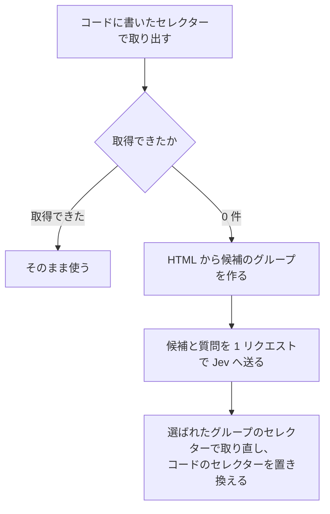

HTML から決まった項目を取り出すコードは、一度書いて終わりにはなりません。ニュースサイトから最新の記事をまとめて集めたいとして、記事の一覧ページから見出しと配信元と掲載時刻を取り出す処理を書きます。そのページの HTML が作り直されれば、同じコードはその日から何も取得できなくなります。

取り出し方として広く使われているのは、HTML をそのまま生成モデルに渡して、必要な項目を書き出してもらう書き方です。渡すのは HTML そのものなので、ページの構造が変わっても取り出しに失敗しません。その代わり、1 ページ分の HTML は 12 万バイトを超えることもあり、入力トークンがそのままページ数に比例して増えます。

もう 1 つ広く使われているのは、対象のページを最初に 1 回だけ調べて、CSS セレクターをコードに書いておく書き方です。取り出しはコードの中で完結するので、ページあたりの費用はかかりません。その代わり、サイト側の HTML が変わると、書いておいたセレクターは一致しなくなり、取得は 0 件です。

セレクターが一致しなくなったときだけ、生成モデルに HTML 全体を渡して書き直してもらう案もあります。ただし入力トークンは渡した HTML の大きさに比例します。今回題材にしたページで数えると、HTML 1 ページ分は 5 万トークンを超えました。取り出したい項目は決まっていて、必要なのはそのありかを選ぶ判断だけです。それでも、選び直しのたびに HTML 1 ページ分をそのまま送ることになります。

## Jev に渡せる判断の形

2026 年 9 月 10 日に、TypeSafe が Jev というモデルを公開しました。Jev は System One モデルと呼ばれる種類の最初のモデルで、文章を生成しません。返すのは、あらかじめこちらが決めた選択肢のうちどれかと、選択肢ごとの確率です。

リクエストに入れるのは `state`、`model`、`questions` の 3 つです。`state` は判断の材料で、文字列でも JSON のオブジェクトでも配列でも渡せます。`questions` は質問 ID をキーにしたマップで、同じ `state` に対して複数の質問を入れられます。

質問の型のうち、選択肢から 1 つを選ぶものが Choice です。`instructions` に何を選んでほしいかを書き、`criteria` に選択肢の名前と説明のマップを置きます。

```json
{
  "model": "jev-latest",
  "state": "注文した靴のサイズが違いました。26.0 cm に交換できますか。",
  "questions": {
    "department": {
      "type": "choice",
      "instructions": "Which team should handle this?",
      "criteria": {
        "returns": "Exchanges, refunds, wrong or damaged items",
        "shipping": "Delivery status, delays, lost packages",
        "billing": "Charges, invoices, payment problems"
      }
    }
  }
}
```

応答に入る答えのキーは、リクエストで付けた質問 ID です。

```json
{
  "model": "jev-1.13.0",
  "answers": {
    "department": {
      "type": "choice",
      "choice": "returns",
      "confidence": 1.0,
      "probabilities": { "shipping": 0.0, "returns": 1.0, "billing": 0.0 }
    }
  },
  "usage": { "input_tokens": 330, "output_tokens": 34 }
}
```

`choice` が確率のいちばん高い選択肢、`probabilities` が全選択肢の確率で、合計は 1 になります。`confidence` は[その分布がどれだけ 1 つの選択肢に集まっているか](https://docs.typesafe.ai/confidence)を 0 から 1 で表した値です。1 つの質問に置ける選択肢は [255 個まで](https://docs.typesafe.ai/primitives/choice)です。

`model` に `jev-latest` を指定すると、応答の `model` には答えたバージョンが入ります。この記事で試したときは `jev-1.13.0` でした。課金されるのは入力トークンだけで、出力トークンは無料です。`jev-1.13.0` の単価は [1M input token あたり $0.042](https://docs.typesafe.ai/models) です。

## この記事で作るもの

コードに書いた CSS セレクターが 0 件になった時点で、そのページの HTML から候補のグループをコード側で作り、どのグループが見出しかという判断だけを Jev に送って、セレクターを置き換える仕組みを作ります。

題材にしたのは、記事が 13 件並ぶニュースの一覧ページと、そこから開ける記事ページです。取り出す項目は、一覧ページが見出し・配信元・掲載時刻、記事ページがタイトル・本文・配信元・掲載日時です。

サイト側の変更を待つことはできないので、取得済みの HTML を自分で書き換えて 3 パターン用意しました。正しく選び直せたかどうかは、前回取れていた値の並びと一致するかで見ています。



Jev に送るリクエストは、この流れの中で 1 回だけです。実際に動かすと、3 項目とも 13 件そろって取り直せました。

## 用意するもの

動かすには、Python と lxml、そして TypeSafe の API キーを用意します。

```bash
pip install lxml cssselect tiktoken
export TYPESAFE_API_KEY="apikey_..."
```

`cssselect` は、lxml で CSS セレクターを使うために別途入れるパッケージです。`tiktoken` は入力量を数えるところだけで使うので、選び直しそのものには必要ありません。API キーはリポジトリに置かず、環境変数から読み込みます。

題材の HTML はあらかじめファイルに保存しておき、以降のコードは `lxml.html.parse()` でそのファイルを読みます。Jev へのリクエストは標準ライブラリの `http.client` で送れるので、HTTP クライアントのライブラリは入れていません。

```python
import http.client
import json
import os
import re
from collections import defaultdict

KEY = os.environ["TYPESAFE_API_KEY"]
MODEL = os.environ.get("TYPESAFE_MODEL", "jev-latest")
```

以降のコードは、この import がそろっている前提です。

## 候補をコードで作る

### 同じ形で繰り返される要素をグループにまとめる

一覧ページには同じ構造の要素が件数の分だけ並ぶので、その繰り返しから候補を作ります。

各要素について、祖先をたどって「タグ + class」の並びを作り、それをキーにして要素を集めます。同じキーに集まるのは、ページ上で同じ役割の要素です。

```python
from lxml import cssselect


def signature(node):
    classes = stable_classes(node)
    return node.tag + ("." + ".".join(sorted(classes)) if classes else "")


def path_of(node):
    path = []
    current = node
    while current is not None and isinstance(current.tag, str):
        path.append(signature(current))
        current = current.getparent()
    return list(reversed(path))


def own_text(node):
    return " ".join("".join(node.itertext()).split())[:120]


def matches(document, selector):
    try:
        return cssselect.CSSSelector(selector)(document)
    except Exception:
        return []
```

`stable_classes()` と `shortest_selector()` は、この後の見出しで定義します。ここまでを貼っただけでは動きません。

`matches()` が例外を捨てて空のリストを返すのは、組み立てたセレクターに `cssselect` が対応していない記法が入った候補を、0 件として扱うためです。

`isinstance(current.tag, str)` で絞っているのは、lxml が HTML コメントも子要素として返すためです。コメントの `tag` には関数が入るので、文字列かどうかで見分けられます。

候補にするのは、集めたグループのうち 3 回以上繰り返すものだけです。3 件のテキストの例がすべて同じ文字列になるグループは、決まったラベルなので外します。

```python
MIN_REPEAT = 3
MAX_CANDIDATES = 254


def candidates(document):
    groups = defaultdict(list)
    for node in document.iter():
        if not isinstance(node.tag, str) or not own_text(node):
            continue
        groups["/".join(path_of(node))].append(node)

    result = {}
    for path, nodes in groups.items():
        if len(nodes) < MIN_REPEAT:
            continue
        samples = [own_text(n) for n in nodes[:3]]
        # 同じ文字列しか出ないグループは、値ではなく定型のラベルなので除く
        if len(set(samples)) == 1:
            continue
        selector = shortest_selector(document, path.split("/"), len(nodes))
        result[path] = {"selector": selector, "count": len(nodes), "samples": samples}
    ranked = sorted(result.items(), key=lambda kv: -kv[1]["count"])[:MAX_CANDIDATES]
    return {f"g{i}": value for i, (_, value) in enumerate(ranked)}
```

`MAX_CANDIDATES` を 254 にして、1 つの質問に置ける選択肢 255 個のうち 1 つを、後述する `NONE` に空けています。この一覧ページでは候補が 30 グループにしかならず、上限を超える場面は来ませんでした。

### 生成された class 名を候補から取り除く

この仕組みを最初に動かしたとき、見出しとして選ばれたセレクターは次のものでした。

```
div.cyTGbM.sc-1t7ra5j-5 > div.eslDfH.sc-1t7ra5j-6 > p.jYbJVt.sc-1t7ra5j-7
```

13 件すべてが取れているので、選択そのものは正しいです。それでも、このセレクターをコードに書き戻すことはできません。

題材にしたページは styled-components で作られています。styled-components は、CSS を JavaScript のコードの中に書き、その内容から class 名を自動で作って要素に付けるライブラリです。書き手が class 名を決める場面がありません。`jYbJVt` はスタイルの中身から作られた class 名で、`sc-1t7ra5j-7` はコンポーネントを識別するための id です。後者は、コンポーネントを定義したファイルから作られたハッシュと、そのファイルの中での連番でできています。スタイルの中身やコンポーネントの並びが変われば、どちらも別の文字列になります。

つまり、選び直した結果に入っているのは、セレクターが一致しなくなった原因そのものです。そこで、候補を作る段階で生成された class 名を取り除きます。styled-components が同じ要素に付けるのは、`sc-<ハッシュ>-<連番>` の形の class と、スタイルから生成した class の 2 つです。片方を見つけたら、その要素の class はすべて取り除きます。

```python
STYLED_COMPONENT = re.compile(r"^sc-[0-9a-z]+-\d+$")
HASHISH = re.compile(r"^(?=.*[a-z])(?=.*[A-Z])[A-Za-z0-9]{4,9}$")


def stable_classes(node):
    """ビルドのたびに変わる class を取り除く。これがセレクターの一致しなくなる原因そのもの"""
    tokens = node.get("class", "").split()
    if any(STYLED_COMPONENT.match(t) for t in tokens):
        return []
    return [t for t in tokens if not HASHISH.match(t)]
```

`HASHISH` が拾うのは、大文字と小文字の両方を含む 4〜9 文字で、区切り記号を含まない class 名です。`jYbJVt` や `eslDfH` が該当し、`article_body` や `highLightSearchTarget` は区切りや長さで外れます。

id も署名に入れていません。題材にした一覧ページは 3 つの区画に分かれており、id を入れると同じ見た目の 13 件が 5 件・5 件・3 件の別グループに分かれます。id を署名から外すことで、13 件を 1 つのグループとして扱えます。

### 同じ件数が取れる範囲でいちばん短いセレクターにする

class を取り除くと、残るのはタグの並びだけです。`path_of` が返すのは `html > body > div > div > ... > p` という長い並びで、途中に `div` が 1 つ増えただけで一致しなくなります。

そこで、この並びの後ろから 1 段ずつ伸ばしていき、元と同じ件数が取れた時点で止めます。

```python
def shortest_selector(document, path, size):
    """同じ件数が取れる範囲でいちばん短い後方一致を選ぶ。長い経路は少しの構造変更で一致しなくなる"""
    for depth in range(1, len(path) + 1):
        selector = " > ".join(path[-depth:])
        if len(matches(document, selector)) == size:
            return selector
    return " > ".join(path)
```

見出しはこれで `a > div > div > div > p`、掲載時刻は `time` だけです。

## Jev に選ばせる

候補 1 つは、セレクター、出現回数、テキストの例 3 件で表します。Jev へはこの形で渡します。

```json
{
  "selector": "a > div > div > div > p",
  "occurrences": 13,
  "examples": ["(1 件目の見出し)", "(2 件目の見出し)", "(3 件目の見出し)"]
}
```

`examples` に入るのは、その要素が実際に持っているテキストを 120 文字で切ったものです。上の例では記事の見出しが 3 件並びます。

質問と指示は英語で書き、`examples` に入る値は日本語のままにしました。

候補の集合は `criteria` に、「どのグループが見出しか」は `instructions` に置きます。1 リクエストには項目の数だけ質問を入れられるので、3 項目なら質問は 3 つです。

```python
def ask(groups, wants, state):
    criteria = {
        key: {"selector": v["selector"], "occurrences": v["count"], "examples": v["samples"]}
        for key, v in groups.items()
    }
    criteria["NONE"] = "No group on this page contains the requested data."
    rules = (
        "Each option is a group of repeated elements from one page. "
        "Examples show the text those elements contain. "
        "Choose the group whose examples are the requested data itself, "
        "not a label, a navigation item, or a different field."
    )
    if "previously_collected" in state:
        rules += PREVIOUS_RULE
    questions = {
        name: {
            "type": "choice",
            "instructions": {"task": description, "rules": rules},
            "criteria": criteria,
        }
        for name, description in wants.items()
    }
    body = {"model": MODEL, "state": state, "questions": questions}
    connection = http.client.HTTPSConnection("api.typesafe.ai")
    connection.request(
        "POST",
        "/v1/systemone",
        json.dumps(body),
        {"Authorization": f"Bearer {KEY}", "Content-Type": "application/json"},
    )
    return json.loads(connection.getresponse().read())
```

選ばれた候補のキーから、そのままセレクターを取り出せます。

```python
answer = payload["answers"]["headline"]
selector = groups[answer["choice"]]["selector"]  # "a > div > div > div > p"
```

`NONE` を入れているのは、そのページに存在しない項目のためです。Choice は与えた選択肢のうちどれかを返すので、`NONE` が無いと、欄そのものが無い項目にも別のグループが割り当てられます。自社の記事だけを載せているサイトには配信元の欄がありません。別のニュースサイト 2 つで試したところ、どちらも配信元について `NONE` が選ばれました。

質問の評価は[並列に行われます](https://docs.typesafe.ai/patterns/fan-out)。候補を 5 件に固定したまま質問を 1 問から 4 問に増やしたときの所要時間は、中央値で 259 ms から 267 ms でした(ウォームアップ 1 回の後に 5 回ずつ送信)。待ち時間を決めているのは入力量のほうです。`criteria` は質問ごとに複製されて送られるため、入力トークンは項目数にほぼ比例します。3 項目をまとめて送ると、1 項目だけのときの約 2.9 倍になり、応答も 693 ms から 977 ms に伸びました。

## 一覧ページで動かした結果

### 0 件になったセレクターからの選び直し

「今コードに入っている値」は、前のビルドの class 名を含む次の 3 つです。

```python
CURRENT = {
    "headline": "div#accr > ol > li > a > div > div > div > p.sc-8ymzcm-7",
    "publisher": "div#accr > ol > li > a > div > div > div > span.sc-8ymzcm-9",
    "timestamp": "div#accr > ol > li > a > div > div > div > time.sc-8ymzcm-12",
}
```

3 つとも 0 件になり、候補 30 グループから選び直しが始まりました。結果は次のとおりです。

| 項目 | 選び直した後のセレクター | 取得 | confidence |
|---|---|---:|---:|
| 見出し | `a > div > div > div > p` | 13 件 | 0.27 |
| 配信元 | `div > div > span` | 13 件 | 0.84 |
| 掲載時刻 | `time` | 13 件 | 0.93 |

3 項目とも、class 名付きのセレクターで取れていた 13 件と同じ内容が取れました。掲載時刻について選ばれたセレクターは `time` だけです。class を取り除いた結果、要素の種類がそのまま答えになりました。

見出しの confidence は 0.27 で、選択は正しいものの確率は分散しています。同じページに見出しらしいグループが複数あるためです。

### 構造が変わった HTML を自分で作る

サイト側のビルドが変わる場面を外から用意できないので、取得済みの HTML を書き換えて 3 パターン作りました。内容は次のとおりです。

| 変更 | 内容 |
|---|---|
| class 名の変更 | `sc-<ハッシュ>-<連番>` と対になる生成 class を別の名前に置き換える |
| `div` の追加 | 記事 1 件ごとに、親の `div` を 1 段増やす |
| タグの変更 | 見出しの `p` を `h3` にする |

class 名の置き換えには、seed を固定した乱数を使いました。seed が同じなら、同じ HTML からは毎回同じ class 名ができます。styled-components が名前をどう作るかまでは真似ておらず、再ビルドで名前がすべて別の文字列になるという結果だけを再現しています。これは HTML を書き換える側のスクリプトで、選び直し側とは別のファイルです。同じ `STYLED_COMPONENT` という名前を使っていますが、こちらは HTML の文字列全体に対して置換するため、前後を固定する `^` と `$` が付いていません。

```python
import random

STYLED_COMPONENT = re.compile(r"sc-[0-9a-z]+-\d+")
ALPHABET = "abcdefghijklmnopqrstuvwxyzABCDEFGHIJKLMNOPQRSTUVWXYZ"


def rename_classes(source, seed=20260919):
    """styled-components はビルドのたびに class 名を作り直す。その結果だけを再現する"""
    rng = random.Random(seed)
    components = {}

    def component(match):
        suffix = match.group(0).rsplit("-", 1)[1]
        fresh = "".join(rng.choices(ALPHABET.lower() + "0123456789", k=7))
        return components.setdefault(match.group(0), f"sc-{fresh}-{suffix}")

    renamed = STYLED_COMPONENT.sub(component, source)

    generated = {}

    def attribute(match):
        tokens = []
        for token in match.group(1).split():
            if token.startswith("sc-") or not re.fullmatch(r"[A-Za-z]{5,8}", token):
                tokens.append(token)
            else:
                fresh = "".join(rng.choices(ALPHABET, k=len(token)))
                tokens.append(generated.setdefault(token, fresh))
        return f'class="{" ".join(tokens)}"'

    return re.sub(r'class="([^"]*)"', attribute, renamed)
```

置き換えの対象は、`sc-` で始まる class と、同じ要素に付いている生成 class の両方です。同じ名前には同じ置き換え先を使うので、ページ全体の対応関係は保たれます。

`div` の追加とタグの変更は lxml のツリーを書き換えて作ります。書き出しに `lxml.html.tostring()` を使うときに必要なのが `include_meta_content_type=True` です。付けないと `<meta charset>` の宣言が消え、読み直したときに ISO-8859-1(Latin-1)として解釈されて日本語が読めなくなります。

### 3 パターンでの取得件数

3 パターンそれぞれに対し、変更前のセレクターで何件取れるかを数えました。

| セレクター | 元 | class 名の変更後 | `div` の追加後 | `h3` 化後 |
|---|---:|---:|---:|---:|
| `p.sc-1t7ra5j-7` | 13 | 0 | 13 | 0 |
| `a > div > div > div > p` | 13 | 13 | 0 | 0 |
| `div > div > span` | 13 | 13 | 26 | 13 |
| `time` | 13 | 13 | 13 | 13 |

1 行目と 2 行目が対になっています。生成された class 名を含むセレクターは、class 名が変わると 0 件になり、`div` が増えても 13 件のままです。class を外したセレクターはその逆になりました。見出しについては、どちらの変更でも 13 件を保つ形を作れていません。

一方で `time` は 4 通りすべてで 13 件を保っています。掲載時刻のように、取り出したい値がページ上で特定のタグと 1 対 1 で対応していれば、class を外したセレクターがそのまま短いタグ 1 つになります。この 3 パターンの変更では一致し続けました。ただし、タグそのものが別のものに変われば、この形でも取れなくなります。

### 1 回あたりの入力とコスト

選び直し 1 回の入力量です。0 件になったセレクターから選び直したときと同じ一覧ページで計測しました。

| 条件 | 候補グループ | 入力トークン | リクエスト | 応答 |
|---|---:|---:|---:|---:|
| 3 項目まとめて | 30 | 12,541 | 44,374 bytes | 977 ms |
| 1 項目のみ | 30 | 4,359 | 14,842 bytes | 693 ms |

この仕組みを実際に動かすときの 1 回分にあたるのが、3 項目をまとめた行になります。同じ HTML 全体(126,168 bytes)を `o200k_base`[^tokenizer] で数えると 52,703 トークンです。3 項目をまとめて送った入力はその 23.8%、1 項目なら 8.3% にあたります。

`jev-1.13.0` の単価で計算すると、3 項目で $0.00053、1 項目で $0.00018 になります。

項目をまとめても、入力トークンと待ち時間はどちらも項目数とともに増えました。まとめる利点は、1 項目ずつ順に 3 回送る場合より短く済むところだけです。

## 前回取れていた値を state に渡す

3 パターンの HTML に対して選び直しを 3 回ずつ実行しました。見出しについて選ばれたグループは次のとおりです。

| ケース | 前回値 | 3 回の選択 |
|---|---|---|
| class 名の変更 | なし | `a > div > div > div > p`(13 件)2 回 / `div > div > div > ul > li > a`(8 件)1 回 |
| class 名の変更 | あり | `a > div > div > div > p`(13 件)3 回 |
| `div` の追加 | なし | `div > div > div > ul > li > a`(8 件)3 回 |
| `div` の追加 | あり | `a > div > div > div > div > p`(13 件)3 回 |
| `h3` 化 | なし | `h3`(13 件)3 回 |
| `h3` 化 | あり | `h3`(13 件)3 回 |

前回値なしの 3 行を見ます。`div > div > div > ul > li > a` で取れる 8 件は、ページ右側にある別の見出し一覧です。これも見出しなので、「記事の見出しはどれか」という質問だけでは、同じページに 2 つある見出しの列を区別できません。

同じ構造のデモ用ページを作り、2 つのグループがページ上のどこを指すかを枠で示しました。青が 13 件の記事の見出し、オレンジが右側にある 8 件の見出し一覧です。


このデモ用ページは、題材にしたページと同じセレクターで同じ件数が取れるように作ってあります。`a > div > div > div > p` で 13 件、`div > div > div > ul > li > a` で 8 件です。どちらのグループも、テキストは記事の見出しそのものです。セレクター、出現回数、テキストの例だけを渡された側に、どちらが目当ての 13 件かを決める材料はありません。

そこで、前回取れていた値を `state` に入れ、`ask()` の `rules` に足す 1 文を用意しました。

```python
PREVIOUS_RULE = (
    " `previously_collected` holds the values this program retrieved before the page changed. "
    "Choose the group that continues that same list, matching its kind of value and its length."
)
```

`state` に入れるのは、項目ごとの件数と値の例です。

```json
{
  "page": "A news category listing page",
  "previously_collected": {
    "headline": {
      "count": 13,
      "examples": [
        "(前回 1 件目に取れていた見出し)",
        "(前回 2 件目に取れていた見出し)",
        "(前回 3 件目に取れていた見出し)"
      ]
    }
  }
}
```

これで 3 パターンとも件数まで一致する選択に変わりました。別に 1 回ずつ実行したときの見出しの confidence は、前回値なしが 0.34 / 0.26 / 0.44、前回値ありが 0.96 / 0.92 / 0.92 です。値の例 3 件を入れたこの形で、入力は 12,541 から 12,898 トークンへ、2.8% 増えただけでした。

### state に入れる量を 4 条件で比べる

上の表と同じ 9 リクエスト(3 パターンの HTML × 3 回)について、正解の数と入力トークンを 4 条件で数えました。0 件になっていた項目の選択は 15 件あります。class 名の変更では 3 項目とも 0 件になり、残る 2 パターンは見出しだけが対象でした。正解は、前回取れていた値の並びとそのまま一致したものです。

| `state` に入れたもの | 正解 | 入力トークン(9 リクエストの合計) |
|---|---:|---:|
| 何も入れない | 11 / 15 | 64,398 |
| 件数だけ | 9 / 15 | 65,247 |
| 値の例 1 件 + 件数 | 15 / 15 | 65,820 |
| 値の例 3 件 + 件数 | 15 / 15 | 66,531 |

件数だけの行と、値の例 1 件の行を見比べます。件数だけを渡した 9 / 15 は、何も渡さない 11 / 15 より下がりました。13 件という数だけを判断の材料にすると、記事カード全体を指す `a > div > div` や、その 1 つ上の親要素が選ばれます。どれも 13 件あるので条件は満たしますが、取れるのはカードの中身をつなげた文字列です。

値の例を 1 件入れると 15 / 15 になり、3 件に増やしても結果は変わりません。保存しておくのは、項目ごとに前回の値 1 件で足ります。

### 取得件数が 0 にならない変化

`div` を 1 段増やしたとき、配信元の `div > div > span` は 0 件ではなく 26 件になりました。親の `div` が 1 段増えたことで、同じ形のたどり方が 2 通りできたためです。

取得は失敗しないので、0 件になったことを選び直しの開始条件にする作りでは、この変化のときに選び直しが始まりません。前回の件数も保存しておき、件数のずれも開始条件に加えました。件数を `state` に入れると選択は悪くなりましたが、それはモデルへ渡す材料としての話で、選び直しを始めるかどうかをコード側で判断する材料としては使えます。

## 繰り返し構造が無い記事ページ

ここまでの候補づくりは「同じ構造が 3 回以上繰り返す」ことを前提にしています。記事ページにその前提はありません。実際、一覧用の候補生成を記事ページで動かすと候補は 23 グループになり、中身はヘッダーのナビ、アクセスランキングの 10 件、関連記事のリンクだけでした。記事本体のタイトル、本文、配信元、日時は 1 つも含まれません。

### 1 回しか出ない要素も候補にする

繰り返しの条件を外す代わりに、別の 2 つで絞りました。`script` などの中のテキストを数えないことと、子がそのまま同じテキストを持つ要素を候補にしないことです。

```python
SKIP = ("script", "style", "noscript")


def text_of(node):
    parts = node.xpath(
        ".//text()[not(ancestor::script) and not(ancestor::style) and not(ancestor::noscript)]"
    )
    return " ".join(" ".join(parts).split())[:120]


def candidates(document):
    """1 回しか出ない要素も候補にする。詳細ページには繰り返しという前提が無い"""
    groups = defaultdict(list)
    for node in document.iter():
        if not isinstance(node.tag, str) or node.tag in SKIP:
            continue
        text = text_of(node)
        # 子がそのまま同じテキストを持つなら、その要素は子と同じ内容しか持たないので候補にしない
        if not text or any(text_of(c) == text for c in node if isinstance(c.tag, str)):
            continue
        groups["/".join(path_of(node))].append(node)

    result = {}
    for path, nodes in groups.items():
        samples = [text_of(n) for n in nodes[:3]]
        if len(nodes) > 1 and len(set(samples)) == 1:
            continue
        result[path] = {
            "selector": shortest_selector(document, path.split("/"), len(nodes)),
            "count": len(nodes),
            "samples": samples,
        }
    ranked = sorted(result.items(), key=lambda kv: -kv[1]["count"])[:MAX_CANDIDATES]
    return {f"g{i}": value for i, (_, value) in enumerate(ranked)}
```

この 2 つで候補は 57〜67 グループに収まりました。試した記事では 255 個の上限を超えていません。

変更前の記事ページに対して、前回値なしで聞いた結果です。

| 項目 | 選ばれたセレクター | confidence | 判定 |
|---|---|---:|---|
| タイトル | `article > header > h1` | 0.96 | 正しい |
| 本文 | `div.article_body.highLightSearchTarget > div > p` | 0.89 | 正しい |
| 掲載日時 | `p > time` | 0.48 | 正しい |
| 配信元 | `div > header > h1` | 0.48 | サイト名を選んだ |

外れているのは配信元の行だけでした。取れたのはサイト全体の名前で、正しい値は記事下の `footer > a` にある媒体名です。

### 件数 1 という条件の置きどころ

配信元について、まず質問の書き方を変えました。

```python
REWRITTEN = (
    "Which group contains the name of the media outlet that wrote this article? "
    "Not the site that hosts it."
)
```

この質問で 3 回聞くと、3 回とも `footer > a` が選ばれ、正しい媒体名が取れました。confidence は 0.54 / 0.55 / 0.57 です。

次に、`state` に「この項目はページに 1 つしかない」という意味で件数 1 を渡しました。選択は変わらず、confidence は 0.60 でした。

最後に、候補そのものを件数 1 のグループだけに絞ってから聞きました。

```python
groups = {k: v for k, v in candidates(document).items() if v["count"] == 1}
```

3 回とも選ばれたのは同じ `footer > a` で、confidence は 0.74 / 0.68 / 0.68 でした。

| 条件 | 選ばれたセレクター | confidence |
|---|---|---|
| 質問を書き直す | `footer > a` | 0.54 / 0.55 / 0.57 |
| 質問を書き直し、`state` に件数 1 を足す | `footer > a` | 0.60 |
| 候補を件数 1 のグループだけに絞る | `footer > a` | 0.74 / 0.68 / 0.68 |

3 条件とも正しい媒体名にたどり着いていますが、確率の集まり方には差が出ました。配信元の 1 項目で見たかぎりでは、件数 1 という条件を `state` の文章で伝えるより、その条件に合わない候補を渡さないほうが、確率は 1 つの選択肢に集まりました。コード側で表せる条件は、質問に書かずに候補の絞り込みへ回したほうが、後から confidence を閾値にして判断しやすくなります。ただしこの絞り込みは、記事ごとに段落数が変わる本文には使えません。

この 4 つのセレクターを同じサイトの別の記事で使うと、いずれもその記事のタイトル、本文、配信元、日時が取れました。別の記事 1 件で確かめた範囲では、1 度選び直したセレクターが同じサイトの他の記事にも一致します。

### 別の記事の前回値を渡した場合

一覧ページでは、前回取れていた値は同じページの続きでした。記事ページでは、前回取れた値は別の記事のもので、文字列は一致しません。

記事ページを変更(`article` の子に親の `div` を 1 段足し、`article_body` を `articleBody` に変え、`time` を `span` にする)したうえで、別の記事の前回値を渡しました。

| 条件 | タイトル | 本文 | 掲載日時 |
|---|---:|---:|---:|
| 前回値なし | 0.94 | 0.81 | 0.75 |
| 別の記事の前回値 | 0.59 | 0.57 | 0.59 |
| 別の記事の値だと伝える 1 文を足す | 0.85 | 0.51 | 0.65 |

選択自体は 3 条件とも同じでしたが、前回値を入れたほうが confidence は下がりました。一致しない例を渡すと、確率を分散させる材料が 1 つ増えます。「これは別の記事の値なので、値の種類だけを見てほしい」と伝える 1 文を足しても、元の値までは戻りませんでした。

掲載日時は 3 条件とも、アクセスランキングにある 10 件の日時が選ばれています。この HTML には記事本体の日時だけを指す候補が無く、前回値の渡し方では変わりません。

前回値を渡すかどうかは、ページの種類で決めます。一覧ページのように前回と同じ列が並び続けるページには渡し、記事ページのように URL ごとに中身が変わるページには渡しません。

## この作りで直せない変化

### 別の意味の兄弟と同じ構造になったタグ

記事ページの日時は、変更前は次のようになっていました。

```html
<p class="sc-uzx6gd-4 kxaOcP"><time>9/18(金) 15:35</time><span class="sc-uzx6gd-5 fkWiCi">配信</span></p>
```

`time` を `span` にすると、日時の要素は隣の「配信」と同じグループ(`p > span`、2 件)に入ります。日時だけを指す候補が作れないため、残るのはその 1 つ上の `p`(`9/18(金) 15:35 配信`)か、アクセスランキングにある `div > div > time` の 10 件です。選ばれたのは後者で、記事本体の日時は取れませんでした。候補に無い値は選べないので、これは質問の書き方では直せません。

### 同じ入力に対する選択のばらつき

class 名を変更した HTML に前回値なしで 3 回聞いたうち、1 回は 8 件のグループが選ばれました。選択がばらついた前回値なしの見出しの confidence は 0.26 から 0.44、3 回とも同じ選択になった前回値ありは 0.92 から 0.96 です。この差を境にして、低いときは選び直しを人の確認に回します。

### 正しさの判定に必要な前回の値

ここまでの「正しい」は、前回取れていた値の並びとそのまま一致するかで数えた結果です。この判定は、前回の値が手元にあるから使えます。そのページから初めて取り出すときには使えません。

## まとめ

- CSS セレクターが 0 件になった時点で候補をコード側で作り、どれが目当ての項目かを選ぶ判断だけを Jev に送ると、一覧ページの見出し、配信元、掲載時刻を 13 件そろえて取り直せる
- 3 項目をまとめた 1 リクエストの入力は 12,541 トークン、$0.00053 になる。同じ HTML 全体を `o200k_base` で数えた 52,703 トークンの 23.8% にあたる。入力量を決めるのは HTML の大きさではなく、候補の数と項目の数である
- 生成された class 名を候補から取り除くと、class 名だけが変わったときは 0 件にならない。代わりにタグの並びが 1 段増えると 0 件になる。一覧ページの見出しでは、どちらの変更でも取れ続けるセレクターは作れなかった
- `div` が 1 段増えると、取得件数が 0 ではなく 2 倍になる場合がある。0 件だけを開始条件にするとこの変化で選び直しが始まらないため、前回の件数とのずれも開始条件に加える
- 件数のように、コード側で表せる条件は、質問の文章に書くより、候補の絞り込みに使うほうが confidence は上がる
- 前回取れていた値を `state` に渡すと、記事の見出しの列と、同じページにある別の見出し一覧を選び分けられる。渡すのは項目ごとに値の例 1 件で足り、件数だけを渡すと何も渡さないときより正解が減る
- 記事ページでは、繰り返しを前提にした候補づくりが使えない。1 回しか出ない要素を候補に入れ、`script` の中身と入れ物の要素を外すと 57〜67 グループに収まる
- 記事ページに別の記事の前回値を渡すと、選択は変わらないまま confidence が下がる。前回値を渡すかどうかは、ページの種類で決める
- 候補に無い値は選べないため、日時のように隣の要素と同じ構造になった値は、質問の書き方では直せない。同じ入力でも選択はばらつくので、confidence が低いときは人の確認に回す

## 参考

https://docs.typesafe.ai/models

https://docs.typesafe.ai/concepts/system-one

https://docs.typesafe.ai/concepts/state

https://docs.typesafe.ai/primitives/choice

https://docs.typesafe.ai/confidence

https://docs.typesafe.ai/patterns/fan-out

https://docs.typesafe.ai/api

https://lxml.de/cssselect.html

https://styled-components.com/

[^tokenizer]: OpenAI の tiktoken が持つトークナイザーの 1 つ。Jev のトークナイザーは公開されていないため、ここでの比較は入力量の目安にとどまります。
