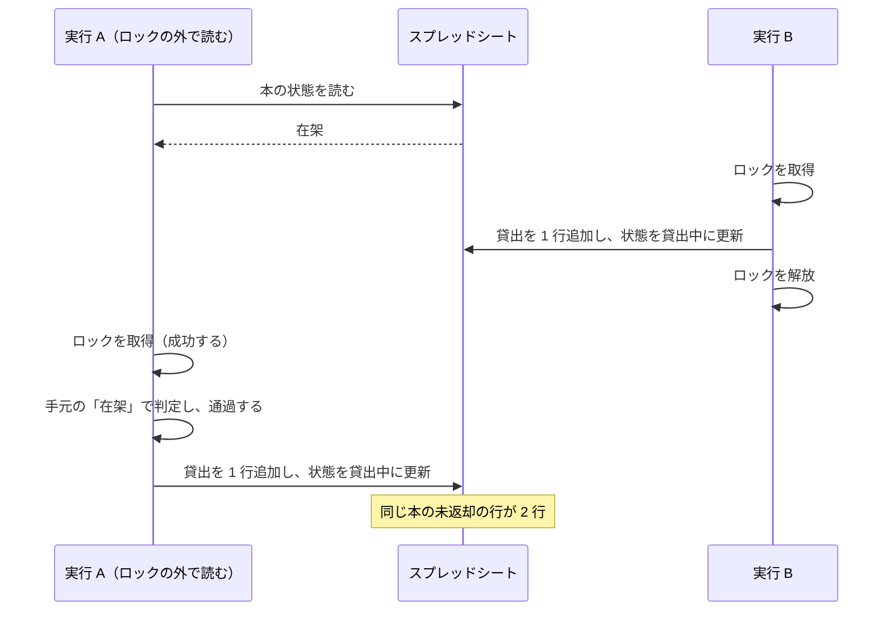

GAS で排他制御がどう実装されるのかを確かめたくて、書籍の貸出を記録するウェブアプリを Google Apps Script とスプレッドシートで作りました。

データの置き場所はスプレッドシートにしましたが、利用者には直接見せたくありません。閲覧できると誰が何を借りているかが全部見えてしまいます。
編集できると貸出の記録を書き換えられます。そこでスプレッドシートは私だけが開ける状態にして、利用者ができる操作はウェブアプリの画面だけに限りました。

1 冊の本を同時に 2 人が借りられては困るので、排他制御が必要になります。GAS でこれを行う仕組みが LockService です。[リファレンス](https://developers.google.com/apps-script/reference/lock/lock-service?hl=ja)の説明は次の 2 文です。

> コードのセクションへの同時アクセスを防ぎます。複数のユーザーまたはプロセスが共有リソースを変更している場合に、競合を防ぐことができます。

ロックを取得してから解放するまでの間、同じロックを使う他の実行は待たされます。貸出の処理をロックの取得と解放ではさめば済むと考えていました。

ところが、ロックを取得していても同じ本の貸出が 2 回実行される書き方があります。
理由は、LockService が同時に実行させないのは同じコードの範囲であって、スプレッドシートの行ではないためです。判定に使う値をロックの外で読むと、その値はロックを取得する前に他の実行から書き換えられている可能性があります。



実行 A がロックを取得できたのは、実行 B がすでに解放しているからです。ロックは正しく適用されています。それでも判定を通ったのは、判定に使う状態が図の 2 行目で読んだ「在架」のままだからです。

この記事に書くのは、その 2 回の貸出を実際に発生させて確かめた結果と、判定に使う値を読む位置の決め方です。

## 書籍貸出アプリとスプレッドシートの構造

排他制御を確かめるために作った書籍貸出アプリは、3 つの画面でできています。自分が借りている本の一覧、蔵書の一覧と絞り込み、管理者だけに表示される登録フォームです。データの保存先はスプレッドシート 1 つで、`books` / `loans` / `config` の 3 シートに分けました。

<!-- TODO(media): スクリーンショットを入れる。/exec を開いた直後のウェブアプリ全体を写す。読者が確認するのは、蔵書の表に「在架」と「貸出中」が並び、管理者のアカウントでは登録フォームが表示されること。代替テキスト: 書籍貸出アプリの画面。自分が借りている本、蔵書の一覧、蔵書の登録フォームが縦に並んでいる -->


このスクリプトは、どのスプレッドシートにも紐づいていません。GAS のスクリプトには、スプレッドシートやドキュメントに紐づけて作る形（コンテナバインド）と、単独で作る形（スタンドアロン）の 2 つがあります。ウェブアプリとして公開するので、後者にしました。

紐づいていないので、読み書きする対象のスプレッドシートは ID を指定して開きます。その ID の置き場所はスクリプトプロパティにしました。最初は `config` シートに書こうとしましたが、`config` シートを読むにはスプレッドシートを開く必要があり、開くには ID が必要です。同じシートの中に置くと、ID を得るために ID が必要になります。

```ts src/sheet.ts
export const SPREADSHEET_ID_PROPERTY = 'SPREADSHEET_ID';

let cachedSpreadsheet: GoogleAppsScript.Spreadsheet.Spreadsheet | undefined;

export function openSpreadsheet(): GoogleAppsScript.Spreadsheet.Spreadsheet {
  if (cachedSpreadsheet) {
    return cachedSpreadsheet;
  }
  const id = PropertiesService.getScriptProperties().getProperty(
    SPREADSHEET_ID_PROPERTY,
  );
  if (!id) {
    throw new Error(
      `スクリプトプロパティ ${SPREADSHEET_ID_PROPERTY} が設定されていません`,
    );
  }
  cachedSpreadsheet = SpreadsheetApp.openById(id);
  return cachedSpreadsheet;
}
```

ID を指定して開くには、`appsscript.json` の `oauthScopes` に権限を書いておく必要があります。スプレッドシート向けの権限は 2 つです。開いているスプレッドシート 1 つだけを許可する `https://www.googleapis.com/auth/spreadsheets.currentonly` と、利用者のスプレッドシート全体を許可する `https://www.googleapis.com/auth/spreadsheets` です。単独で作ったスクリプトには「開いているスプレッドシート」が存在しないため、後者を指定して `openById()` が成功することを確かめました。`currentonly` に変えたときにどうなるかは確かめていません。単独スクリプトで別のスプレッドシートを操作する構成なら、この権限設定が一番簡潔だと思います。

## LockService が同時に実行させない範囲

貸出の処理では、スプレッドシートへの書き込みが 2 か所あります。1 つは `loans` への 1 行の追加、もう 1 つは `books` の該当行の `status` を `lent` にする更新です。この 2 つの間に別の実行が同じ処理を始めると、1 冊の本に貸出の記録が 2 行できます。

LockService が返すロックは 3 種類あります。スクリプト全体を単位にする `getScriptLock()`、利用者ごとの `getUserLock()`、スクリプトを紐づけたドキュメントごとの `getDocumentLock()` です。

このスクリプトは単独で作ったので、使えるのはスクリプトロックです。[リファレンス](https://developers.google.com/apps-script/reference/lock/lock-service?hl=ja)の `getDocumentLock()` には、次の条件が書かれています。

> このメソッドが、包含ドキュメントのコンテキスト外（スタンドアロン スクリプトやウェブアプリなど）から呼び出された場合は、`null` が返されます。

`getScriptLock()` の説明は次の 2 文です。ここに、このロックが何を単位にしているのかが書かれています。

> ユーザーがコードのセクションを同時に実行できないようにするロックを取得します。スクリプト ロックで保護されたコード セクションは、ユーザーの ID に関係なく同時に実行できません。

同時に実行させない対象は「コードのセクション」です。利用者が誰であっても、この範囲を同時に実行できるのは 1 つだけになります。行やセルではなく、コードの範囲が単位です。

`getScriptLock()` を呼んだ時点では、ロックはまだ取得されていません。リファレンスにも、`tryLock(timeoutInMillis)` または `waitLock(timeoutInMillis)` が呼び出されるまでロックは取得されないと書かれています。[`Lock` クラスのリファレンス](https://developers.google.com/apps-script/reference/lock/lock?hl=ja)によると、`tryLock()` は指定したミリ秒でタイムアウトして取得の可否を `Boolean` で返し、`waitLock()` は取得できなかったときに例外を投げます。取得したロックは `releaseLock()` で解放します。今回は、取得できなかったときのメッセージを画面に合わせて自分で決めたかったので、真偽値で分岐できる `tryLock()` にしました。例外を直接捕捉するより処理の流れを把握しやすいと思います。

ロックの取得と解放は関数にまとめました。

```ts src/lending.ts
const LOCK_TIMEOUT_MS = 10_000;

/** ロックの中でしか呼ばない。ロック取得前に読んだ status は他の実行に書き換えられている可能性がある */
function withScriptLock<T>(action: () => T): T {
  const lock = LockService.getScriptLock();
  if (!lock.tryLock(LOCK_TIMEOUT_MS)) {
    throw new Error('混み合っています。しばらくしてからもう一度お試しください');
  }
  try {
    return action();
  } finally {
    lock.releaseLock();
  }
}
```

2 つの実行が同時に入らないのは `action` の中だけです。ロックの取得と解放を毎回手で書くと解放の呼び忘れを起こしやすいので、こうした高階関数にまとめておくのが扱いやすいと感じます。`action` に渡す前に読んだ値は、この範囲の外で読んだ値なので、`action` の中で使っても他の実行から保護されていません。

## 状態を読む位置をロックの外へ出す

貸出の処理を 2 つに分けました。`commitLoan` が判定と書き込みを行い、`lendBook` がロックの取得と `commitLoan` の呼び出しを行います。

```ts src/lending.ts
function commitLoan(
  target: { rowNumber: number; book: Book },
  email: string,
): Loan {
  const { rowNumber, book } = target;
  if (book.status === 'retired') {
    throw new Error('この本は除籍されています');
  }
  if (book.status === 'lent') {
    throw new Error('この本はすでに貸出中です');
  }
  // ...（貸出上限の判定、loans への追加、books.status の更新は省略）
  getSheet(SHEET.books).getRange(rowNumber, BOOKS_COL.status).setValue('lent');
  SpreadsheetApp.flush();
  return loan;
}

export function lendBook(bookId: string): Loan {
  const email = requireActiveUserEmail();
  return withScriptLock(() => commitLoan(findBookRow(bookId), email));
}
```

見るのは `findBookRow` の位置です。`lendBook` では、この呼び出しがコールバックの中にあります。行番号と `status` の取得元は、ロックを取得した後の 1 回の `getValues()` です。

この形なら 2 回目は拒否されます。在架の本を 1 冊選び、`lendBook` を続けて 2 回呼ぶ `probeDoubleLend` を書いて、エディタから実行しました。

```
22:37:50 情報 対象: プラチナデータ (c1a6b626-48e9-420b-9bca-d288c8240436)
22:37:50 情報 1 回目: 成功 loanId=5f8e0eba-4e5f-41cd-88a0-0dccfcb83ef0
22:37:50 情報 2 回目: 失敗 この本はすでに貸出中です
```

`loans` に増えた未返却の行は 1 行で、`books.status` は `lent` になりました。2 回目が拒否された理由は、`findBookRow` が読み直した `status` が `lent` だったためです。

次に、読む位置だけをロックの外へ出した場合を確かめました。`lendBook` との違いが `findBookRow` の位置だけになる関数を用意しています。

```ts src/lending.ts
export function lendBookReadingOutsideLock(
  bookId: string,
  beforeLock: () => void,
): Loan {
  const email = requireActiveUserEmail();
  const target = findBookRow(bookId);
  beforeLock();
  return withScriptLock(() => commitLoan(target, email));
}
```

この形で貸出が 2 回実行されるのは、冒頭の図の順序になったときだけです。`findBookRow` が読んだ `status` は `available` のまま `commitLoan` へ渡り、その間に別の実行が同じ本の貸出を終えていても、判定はその値で行われます。

この順序をブラウザの操作で作ることはできません。そこで `beforeLock` に `lendBook` を渡し、1 回の実行の中で順序を固定しました。

```ts src/probe.ts
lendBookReadingOutsideLock(target.bookId, () => {
  const interrupting = lendBook(target.bookId);
  results.push(`割り込んだ貸出: 成功 loanId=${interrupting.loanId}`);
});
```

```
20:40:38 情報 対象: プラチナデータ (c1a6b626-48e9-420b-9bca-d288c8240436)
20:40:38 情報 割り込んだ貸出: 成功 loanId=f7112ddc-57d8-46b3-a6c6-9a94f5ba2437
20:40:38 情報 ロックの外で読んだ値による貸出: 成功 loanId=cc8e5531-a35c-4ea1-ace7-63a43a579aa7
20:40:38 情報 c1a6b626-48e9-420b-9bca-d288c8240436 の未返却の行: 2 行
```

2 件目の書き込みは `withScriptLock` の中で実行されています。ロックの取得も成功しています。それでも 1 冊の本に未返却の貸出が 2 行できました。

確かめるのに使ったのは、clasp 3.4.1、Apps Script の V8 ランタイム、rollup 4.63.1 です。

## 変更が確定する位置

読む位置と同じ話が、書いた後にもあります。`commitLoan` は `setValue` の直後に `SpreadsheetApp.flush()` を呼ぶ形にしました。

[リファレンス](https://developers.google.com/apps-script/reference/spreadsheet/spreadsheet-app?hl=ja#flush)の `flush()` の説明は「保留中のスプレッドシートの変更をすべて適用します。」で、続けてスプレッドシートの操作が性能のためにまとめられる場合があると書かれています。同じページのサンプルに付いているコメント（日本語のページでも英語のままです）には、`flush()` を呼ばない場合の挙動が書かれています。

> If flush() is not called, the updates may be applied live or may all be applied at once when the script completes.

変更がスクリプトの終了時にまとめて適用される場合、確定するのはロックを解放した後です。次にロックを取得した実行は、確定前の値を読むことになります。ロックの外で読むと古い値が入り、ロックの外で確定すると古い値が残ります。どちらも、ロックの範囲がデータを扱う範囲より狭いことが原因です。

[`releaseLock()` の説明](https://developers.google.com/apps-script/reference/lock/lock?hl=ja#releaselock)にも、スプレッドシートを使う場合はロックを解放する前に `SpreadsheetApp.flush()` を呼び、保留中の変更をコミットするよう書かれています。

`flush()` を外した状態での遅延適用までは検証できていませんが、リファレンスの記述に従って、更新直後に `flush()` を呼んで確定させておくのが安全だと思います。

## 2 つの実行を同時に始める手段

ブラウザのクリックでは、2 つの実行を同じ瞬間に始められません。そこで、スクリプトロックを 20 秒保持するだけの関数を用意しました。

```ts src/probe.ts
const LOCK_HOLD_MS = 20_000;

export function holdScriptLock(): string {
  const lock = LockService.getScriptLock();
  if (!lock.tryLock(1_000)) {
    throw new Error('ロックを取得できませんでした');
  }
  const startedAt = new Date().toISOString();
  try {
    Utilities.sleep(LOCK_HOLD_MS);
  } finally {
    lock.releaseLock();
  }
  const message = `${startedAt} から ${LOCK_HOLD_MS} ミリ秒ロックを保持しました`;
  console.log(message);
  return message;
}
```

これをエディタから実行し、保持している間にウェブアプリで「借りる」を押します。ボタンは 10 秒ほど「通信中です」の表示のまま待たされた後、次のメッセージで失敗しました。

```
Error: 混み合っています。しばらくしてからもう一度お試しください
```

このときの画面で見るのは、エラーの表示と蔵書の状態の 2 つです。

<!-- TODO(media): スクリーンショットを入れる。holdScriptLock の実行中に「借りる」を押した直後のウェブアプリを写す。読者が確認するのは、赤字のエラーメッセージが表示されていることと、蔵書の状態が「在架」のままであること。代替テキスト: 画面上部に「混み合っています。しばらくしてからもう一度お試しください」と赤字で表示され、蔵書の表の状態欄は「在架」のままになっている -->

`LockService.getScriptLock()` は実行をまたいで共有されます。エディタからの実行がロックを保持している間、ウェブアプリからの実行は同じロックの解放を待ちました。`tryLock(10_000)` は 10 秒待っても取得できず、`withScriptLock` で例外が発生しています。蔵書の状態は「在架」のまま、「自分が借りている本」も空でした。`appendRow` と `setValue` はどちらもロックの中にしかないため、書き込みは 1 回も実行されていません。

ここまでの 3 つの試し方は、どれも 2 つの実行を同じ瞬間に始めたものではありません。`probeDoubleLend` は 1 回の実行の中で `lendBook` を 2 回呼んだもの、`probeStaleRead` は `beforeLock` で順序を固定したもの、`holdScriptLock` は先にロックを取得しておいて待たせたものです。同じ瞬間に 2 つの実行を始める手段は、この環境では用意できませんでした。

貸出が 2 回実行されるのは、2 つの実行の順序が冒頭の図の形になったときだけです。ブラウザから手動でいくら連打しても、状態を読んでからロックを取得するまでの間に別の実行が貸出を終える順序を狙って起こすのは難しいと思います。この不具合は再現確認で見つかることを前提にはできません。判定に使う値を読む位置は、動作確認の偶然に頼るのではなく、コードの構造で確実に固定すべきだと感じます。

## まとめ

- LockService が同時に実行させないのは、同じコードの範囲である。スプレッドシートの行ではない。リファレンスの説明は「スクリプト ロックで保護されたコード セクションは、ユーザーの ID に関係なく同時に実行できません」
- ロックの外で読んだ `status` をロックの中で判定に使うと、同じ本の貸出が 2 回実行される。判定に使う値は、ロックを取得した後に読み直す
- シートの変更はスクリプトの終了時にまとめて適用される場合があると、`SpreadsheetApp.flush()` のリファレンスに書かれている。ロックを解放する前に確定させるため、更新の直後に `flush()` を呼ぶ
- スクリプトロックは実行をまたいで共有される。待機時間を超えた側は例外になり、書き込みを実行しない
- 貸出が 2 回実行される順序は、エディタからの実行でもブラウザの操作でも狙って作れなかった。読む位置は、動作確認ではなくコードの構造で固定する

## 参考

https://developers.google.com/apps-script/reference/lock/lock-service

https://developers.google.com/apps-script/reference/lock/lock

https://developers.google.com/apps-script/reference/spreadsheet/spreadsheet-app

https://developers.google.com/apps-script/guides/web

https://developers.google.com/apps-script/guides/v8-runtime

https://suntory-n-water.com/blog/did-you-know-you-can-easily
