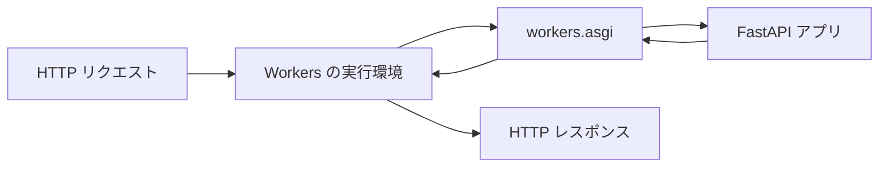

Cloudflare は 2026 年 9 月 21 日に、Cloudflare Workers で Python を動かす機能(Python Workers)を正式版にしました。FastAPI のアプリは、Python Workers の SDK に含まれる `workers.asgi` の関数に渡すだけで Worker として公開できます。

pywrangler でひな形を作り、`uv add fastapi` で依存を追加し、`uv run pywrangler dev` で起動したところ、FastAPI のルーティングと Pydantic による入力チェックがそのまま動きました。`uv run pywrangler deploy` で Cloudflare へ公開した Worker も、ローカルと同じ JSON を返却しました。

手順そのものは短いものの、動かす前に知っておくと迷わない点が 2 つあります。1 つは、pydantic-core のように C や Rust の拡張を含むパッケージでは、手元の `uv.lock` とは別の版が Worker に同梱される場合があることです。もう 1 つは、Worker で使われる Python のバージョンが `pyproject.toml` ではなく、wrangler 設定の `compatibility_date` で決まることです。この記事では、手順に続けてこの 2 点を確かめた結果を紹介します。

## 作る Worker と完成時の動作

作るのは、FastAPI で 3 つのルートを持つ API です。

| メソッドとパス | 動作 |
|---|---|
| `GET /` | メッセージと、Worker 上で動いている Python のバージョンを返却する |
| `GET /items/{item_id}` | パスパラメーターとクエリパラメーターをそのまま返却する |
| `POST /items` | Pydantic のモデルで本文を検証し、税込み価格を計算して返却する |

FastAPI が自動で生成する API ドキュメントの `/docs` も、そのまま Worker から配信されます。

## Python Workers が FastAPI を動かす仕組み

Python Workers は、[Pyodide](https://pyodide.org/) の上で動きます。Pyodide は、CPython を WebAssembly 向けにコンパイルした Python の実行環境です。Cloudflare Workers の実行環境は WebAssembly を動かせるため、その中で Python のコードを実行できます。

FastAPI は、ASGI[^asgi] に沿って作られた Web フレームワークです。ASGI は、Python の Web アプリと Web サーバーの間で、リクエストとレスポンスをどう受け渡すかを定めた仕様です。FastAPI のアプリをサーバーで動かすには、通常は uvicorn などの ASGI サーバーを別に用意します。

Python Workers では、Workers の実行環境そのものがサーバーの役割を担います。SDK の `workers.asgi` は、Workers が受け取ったリクエストを ASGI の形式に変換して FastAPI に渡し、FastAPI の応答を Workers のレスポンスに戻します。[正式版の発表記事](https://blog.cloudflare.com/python-workers-ga/)では、この変換層を「thin, optimized bridge」と説明しています。



図のとおり、uvicorn の位置に `workers.asgi` が入ります。アプリ側のコードは、uvicorn で動かす場合と同じ書き方のままです。

## pywrangler でプロジェクトを作成する

pywrangler は、Python Workers 用のコマンドラインツールです。Workers の標準ツールである wrangler を内部で呼び出し、その前に Python のパッケージを Worker に同梱できる形で配置します。`workers-py` という名前で PyPI に公開されています。

### 前提条件

pywrangler を動かすには、[uv](https://docs.astral.sh/uv/) と Node.js が必要です。uv は Python のパッケージとプロジェクトを管理するツールです。

pywrangler は、uv のバージョンが 0.12.3 未満だと、次のエラーで停止します。

```text
ERROR    uv version at least 0.12.3 required, have 0.8.22.
ERROR    Update uv with `uv self update`.
```

この下限は pywrangler のソースコードの [utils.py](https://github.com/cloudflare/workers-py/blob/main/packages/cli/src/pywrangler/utils.py) で `MIN_UV_VERSION = (0, 12, 3)` として定義されています。古い uv を使っている場合は、先に `uv self update` で更新します。

### ひな形の作成

次のコマンドで、`fastapi-worker` ディレクトリにひな形を作成します。

```bash
uvx --from workers-py pywrangler init fastapi-worker --category=hello-world --type=hello-world --no-git --no-agents
cd fastapi-worker
```

`pywrangler init` は、Cloudflare のプロジェクト作成ツール create-cloudflare に `--lang=python --no-deploy` を付けて引数を渡します。オプションを省略すると対話形式で質問されます。上のコマンドは、「Hello World example」の「Worker only」を選んだ場合と同じ結果になります。

生成されたファイルは次のとおりです。

```text
fastapi-worker/
├── .gitignore
├── .python-version
├── .vscode/settings.json
├── README.md
├── package.json
├── package-lock.json
├── pyproject.toml
├── wrangler.jsonc
└── src/
    ├── entry.py
    └── submodule.py
```

`wrangler.jsonc` の設定項目は次の内容です(生成時のコメントは省略しています)。

```jsonc wrangler.jsonc
{
	"$schema": "node_modules/wrangler/config-schema.json",
	"name": "fastapi-worker",
	"main": "src/entry.py",
	"compatibility_date": "2026-09-21",
	"compatibility_flags": [
		"python_workers"
	],
	"observability": {
		"enabled": true
	}
}
```

`compatibility_flags` の `python_workers` が、この Worker を Python Workers として実行する指定です。`main` には、リクエストを受けたときに最初に読み込まれる Python ファイルを指定します。

`compatibility_date` は、Workers の実行環境をどの日付時点の挙動で動かすかを指定する設定で、ひな形には作成時点の日付が入ります。`compatibility_flags` は互換フラグと呼ばれ、日付とは別に個別の挙動を有効または無効にする設定です。

`pyproject.toml` には、開発用の依存として `workers-py`(pywrangler)と `workers-runtime-sdk`(`workers` モジュール)が入っています。`package.json` の `dev` と `deploy` のスクリプトは、どちらも `uv run pywrangler` を呼び出す内容です。

## FastAPI アプリを workers.asgi で公開する

FastAPI を依存に追加します。

```bash
uv add fastapi
```

`pyproject.toml` の `dependencies` に `fastapi` が追加されます。

```toml pyproject.toml
[project]
name = "fastapi-worker"
version = "0.1.0"
description = "Add your description here"
readme = "README.md"
requires-python = ">=3.12"
dependencies = [
    "fastapi>=0.141.1",
]

[dependency-groups]
dev = ["workers-py", "workers-runtime-sdk"]
```

テンプレートの `src/submodule.py` は使わないため削除し、`src/entry.py` を次の内容に書き換えます。

```python src/entry.py
import sys

from fastapi import FastAPI
from pydantic import BaseModel, Field
from workers import asgi

app = FastAPI()


class Item(BaseModel):
    name: str
    price: int = Field(gt=0)


@app.get("/")
async def root():
    return {"message": "Hello from FastAPI on Workers", "python": sys.version}


@app.get("/items/{item_id}")
async def read_item(item_id: int, q: str | None = None):
    return {"item_id": item_id, "q": q}


@app.post("/items")
async def create_item(item: Item):
    return {"name": item.name, "price_with_tax": item.price * 110 // 100}


Default = asgi.entrypoint(app)
```

最後の行の `Default = asgi.entrypoint(app)` が、FastAPI アプリにリクエストを渡すよう Worker に登録する行です。Python Workers は、`main` のファイルにある `Default` という名前のクラスを呼び出してリクエストを処理します。`asgi.entrypoint` は、受け取った ASGI アプリにリクエストを渡す `Default` クラスを作って返却します。それより上の部分は、uvicorn で動かす FastAPI アプリと変わりません。

## ローカルで起動してレスポンスを確認する

開発サーバーを起動します。

```bash
uv run pywrangler dev
```

初回の起動では、pywrangler が Worker 用の Python(Pyodide)を取得し、依存を Pyodide 向けに解決します。解決した結果は `pylock.toml` に書き出され、パッケージは `python_modules/` に配置されます。その後に `wrangler dev` が呼び出され、次の出力で待ち受けを開始します。

```text
INFO     Passing command to npx wrangler: npx --yes wrangler dev

 ⛅️ wrangler 4.136.3
────────────────────
Attaching additional modules:
┌─────────────────────┬──────┬─────────────┐
│ Name                │ Type │ Size        │
├─────────────────────┼──────┼─────────────┤
│ Vendored Modules    │      │ 8601.32 KiB │
├─────────────────────┼──────┼─────────────┤
│ Total (369 modules) │      │ 8601.32 KiB │
└─────────────────────┴──────┴─────────────┘
⎔ Starting local server...
[wrangler:info] Ready on http://localhost:8787
```

「Vendored Modules」が、`python_modules/` から Worker に同梱されたパッケージです。FastAPI とその依存で 369 モジュール、8,601 KiB になりました。

別の端末から curl でリクエストを送ります。

```bash
curl http://localhost:8787/
curl "http://localhost:8787/items/42?q=sui"
curl http://localhost:8787/items/abc
curl -X POST http://localhost:8787/items -H 'Content-Type: application/json' -d '{"name":"soba","price":1000}'
curl -X POST http://localhost:8787/items -H 'Content-Type: application/json' -d '{"name":"soba","price":0}'
```

それぞれの応答は次のとおりです(`GET /` の Python のバージョン文字列は途中で省略しています)。

```text
{"message":"Hello from FastAPI on Workers","python":"3.14.2 (main, Aug 25 2026, 05:50:55) [Clang 23.0.0git ..."}
{"item_id":42,"q":"sui"}
{"detail":[{"type":"int_parsing","loc":["path","item_id"],"msg":"Input should be a valid integer, unable to parse string as an integer","input":"abc"}]}
{"name":"soba","price_with_tax":1100}
{"detail":[{"type":"greater_than","loc":["body","price"],"msg":"Input should be greater than 0","input":0,"ctx":{"gt":0}}]}
```

1 行目から、Worker 上では Python 3.14.2 が動いていることが分かります。3 行目と 5 行目は、FastAPI が Pydantic で入力を検証し、ステータスコード 422 で返却したエラーです。整数でないパスパラメーターと、`gt=0` の条件を満たさない価格が、それぞれ拒否されています。`http://localhost:8787/docs` を開くと、ステータスコード 200 で返却され、FastAPI の API ドキュメントが表示されました。

## Cloudflare にデプロイする

Cloudflare のアカウントにログインしていない場合は、先に `npx wrangler login` を実行します。ブラウザーで認証すると、以降の wrangler のコマンドがそのアカウントで実行されます。ログインした状態で、次のコマンドを実行します。

```bash
uv run pywrangler deploy
```

```text
Total Upload: 8601.90 KiB / gzip: 2135.56 KiB
Worker Startup Time: 2170 ms
Uploaded fastapi-worker (19.99 sec)
Deployed fastapi-worker triggers (0.68 sec)
  https://fastapi-worker.<アカウントのサブドメイン>.workers.dev
```

アップロードの量は gzip で圧縮した後に 2,135 KiB でした。公開された URL に、curl の 5 つと `/docs` を合わせた 6 つのリクエストを送ったところ、ローカルと同じ本文とステータスコードが返却されました。

動作確認が終わった Worker は、次のコマンドで削除できます。

```bash
npx wrangler delete --name fastapi-worker
```

## Worker に同梱されるパッケージの版と対応状況

Python Workers で使えるパッケージは、Cloudflare のドキュメントで次の 3 種類とされています。

- PyPI で公開されている純 Python のパッケージ
- PyPI で公開されている PyEmscripten 向けの wheel
- Pyodide が配布しているパッケージ

PyEmscripten は、Pyodide 向けにビルドした wheel に付けるプラットフォームタグで、[PEP 783](https://peps.python.org/pep-0783/) で定められています。PEP 783 は 2026 年 4 月 6 日に承認されました。C や Rust の拡張を含むパッケージは、この形式か Pyodide 向けにビルドされたものでないと Worker で読み込めません。

### Worker に同梱される pydantic-core の版

FastAPI が依存する Pydantic は、中核の処理を Rust で書いた pydantic-core を使います。2026 年 9 月 23 日に `uv add fastapi` と `uv run pywrangler dev` で依存を解決し、手元の `uv.lock` に記録された版と、Worker 用の `pylock.toml` に記録された版を比べました。

| パッケージ | `uv.lock`(手元の Python 用) | `pylock.toml`(Worker 用) | Worker 用の取得元 |
|---|---|---|---|
| fastapi | 0.141.1 | 0.141.1 | PyPI |
| starlette | 1.6.0 | 1.6.0 | PyPI |
| **pydantic** | **2.13.5** | **2.12.5** | Pyodide の配布元 |
| **pydantic-core** | **2.46.5** | **2.41.5** | Pyodide の配布元 |

太字にした pydantic と pydantic-core の 2 行は、手元と Worker で版が異なります。Worker 用の pydantic-core は、Pyodide の配布元にある `pydantic_core-2.41.5-cp314-cp314-pyemscripten_2026_0_wasm32.whl` でした。PyPI の pydantic-core には、2.46.5 と 2.41.5 のどちらにも WebAssembly 向けの wheel が公開されていません。uv は、Worker 向けの wheel がある pydantic-core として、Pyodide の配布元にある 2.41.5 を選びました。

pydantic 2.12.5 は、依存として `pydantic-core==2.41.5` を指定しています。pydantic は pydantic-core の版を 1 つに固定しているため、pydantic-core に合わせて pydantic も 2.12.5 に解決されます。

そのため、手元でテストが通っても、Worker では Pydantic のマイナーバージョンが 1 つ古い状態で動きます。たとえば 2.13 で追加された機能に依存するコードは、Worker では動かない可能性があります。こうした版の違いは、デプロイ前に `pylock.toml` と `uv.lock` の版を見比べると確認できます。

### Worker 向けの wheel がないパッケージを追加したときの動作

uvloop は、asyncio のイベントループを C 拡張で置き換えるライブラリで、Windows 以外の環境で `uvicorn[standard]` を入れると一緒に入ります。Pyodide にも含まれていない uvloop を `uv add uvloop` で追加し、`uv run pywrangler dev` を実行しました。wrangler が起動する前に、次のエラーで停止しました(一時ファイルのパスは省略しています)。

```text
ERROR    Error running command: uv pip compile pyproject.toml ...
         --python cpython-3.14.2-emscripten-wasm32-musl --extra-index-url
         https://index.pyodide.org/314.0.7 --index-strategy unsafe-best-match
         --no-header -o pylock.toml --no-build
         Exit code: 1
         Output:
         error: No solution found when resolving dependencies
           cause: Because uvloop==0.22.1 has no usable wheels and only
         uvloop<=0.22.1 is available, we can conclude that uvloop>=0.22.1 cannot
         be used.
...
         hint: Wheels are required for `uvloop` because building from source is
         disabled for all packages (i.e., with `--no-build`)
```

このエラーから、pywrangler が依存を解決する方法が読み取れます。pywrangler は `uv pip compile` を、WebAssembly 向けの Python(`cpython-3.14.2-emscripten-wasm32-musl`)を対象にして実行します。取得元には PyPI に加えて Pyodide のパッケージの配布元を指定し、`--no-build` でソースからのビルドを禁止しています。そのため、WebAssembly 向けの wheel がないパッケージは、ここで解決に失敗します。

使いたいパッケージに Worker 向けの wheel があるかは、`pyproject.toml` に追加して `uv run pywrangler dev` を実行すれば、デプロイ前に確認できます。

## Worker で使われる Python のバージョンを決める条件

ローカルの応答で見たとおり、Worker 上の Python は 3.14.2 でした。一方で、テンプレートの `pyproject.toml` は `requires-python = ">=3.12"`、`.python-version` は `3.12` です。

pywrangler のソースコードの [metadata.py](https://github.com/cloudflare/workers-py/blob/main/packages/cli/src/pywrangler/metadata.py) を確認すると、Worker で使う Python のバージョンは wrangler 設定から決めていました。

| Python | 選ばれる条件 |
|---|---|
| 3.14 | 互換フラグ `python_workers_314` がある、または `compatibility_date` が 2026-09-08 以降 |
| 3.13 | 互換フラグ `python_workers_20250116` がある、または `compatibility_date` が 2025-09-29 以降 |
| 3.12 | `python_workers` のみ |

上の行から順に条件を確認し、最初に当てはまったバージョンを使います。`compatibility_date` が 2026-09-21 のひな形は、3.14 の行に当てはまります。

### compatibility_date を変えた後の依存の同期

`compatibility_date` を `2026-01-01` に変えて `uv run pywrangler dev` を実行すると、Worker の起動に失敗しました。

```text
ModuleNotFoundError: No module named 'pydantic_core._pydantic_core'
```

Worker の実行環境は 3.13 に切り替わりました。一方で、`python_modules/` には 3.14 用の pydantic-core が残ったままでした。3.13 の Python は 3.14 用にビルドされた拡張を読み込めないため、import の段階で失敗します。

pywrangler は、[sync.py](https://github.com/cloudflare/workers-py/blob/main/packages/cli/src/pywrangler/sync.py) で、依存を同期し直すかどうかを `pyproject.toml` と `pylock.toml` の更新時刻だけで判定しています。wrangler 設定を変えてもこの判定には入らないため、3.14 用のパッケージがそのまま使われました。`--force` を付けて同期すると解消します。

```bash
uv run pywrangler sync --force
uv run pywrangler dev
```

同期し直すと、pydantic は 2.10.6、pydantic-core は Pyodide 0.28.3 が配布する 2.27.2 に解決し直されました。起動後の `GET /` は Python 3.13.2 を返却し、ほかのリクエストも 3.14 のときと同じ応答になりました。

Python Workers では、`compatibility_date` が実行環境の挙動に加えて Python のバージョンと、同梱されるパッケージの版も決めます。私は `compatibility_date` を変えたら `pywrangler sync --force` を実行し、`pylock.toml` の差分を確認してからデプロイする手順にしています。

## まとめ

- FastAPI のアプリは `Default = asgi.entrypoint(app)` の 1 行を加えると Python Workers で動く。ルーティングと Pydantic による入力チェックは、ローカルと公開先の両方で同じ応答になった
- pywrangler は uv 0.12.3 以上が必要。`pywrangler init`、`uv add`、`pywrangler dev`、`pywrangler deploy` の順で作成から公開まで行える
- Worker には、Pyodide 向けに解決された `pylock.toml` の版が同梱される。C や Rust の拡張を含むパッケージは、手元の `uv.lock` と版が異なる場合がある。FastAPI の場合は pydantic が 2.13.5 ではなく 2.12.5 になった
- WebAssembly 向けの wheel がないパッケージは、`pywrangler dev` の依存解決の段階で失敗する
- Worker で使われる Python のバージョンは `compatibility_date` と互換フラグで決まる。日付を変えた後は `pywrangler sync --force` で依存を同期し直す

## 参考

https://blog.cloudflare.com/python-workers-ga/

https://developers.cloudflare.com/workers/languages/python/

https://developers.cloudflare.com/workers/languages/python/packages/fastapi/

https://developers.cloudflare.com/workers/languages/python/packages/

https://github.com/cloudflare/workers-py

https://github.com/cloudflare/workers-py/blob/main/packages/cli/src/pywrangler/utils.py

https://github.com/cloudflare/workers-py/blob/main/packages/cli/src/pywrangler/metadata.py

https://github.com/cloudflare/workers-py/blob/main/packages/cli/src/pywrangler/sync.py

https://peps.python.org/pep-0783/

https://pyodide.org/en/stable/usage/packages-in-pyodide.html

https://asgi.readthedocs.io/en/latest/introduction.html

https://fastapi.tiangolo.com/deployment/manually/

[^asgi]: ASGI(Asynchronous Server Gateway Interface)は、同期処理を前提とした WSGI の後継として作られた仕様です。アプリは `scope`、`receive`、`send` の 3 つを受け取る非同期の呼び出し可能なオブジェクトとして書き、サーバーとの間ではイベントを表す辞書を受け渡します。FastAPI のドキュメントでは、FastAPI を ASGI の Web フレームワークと説明しています。
